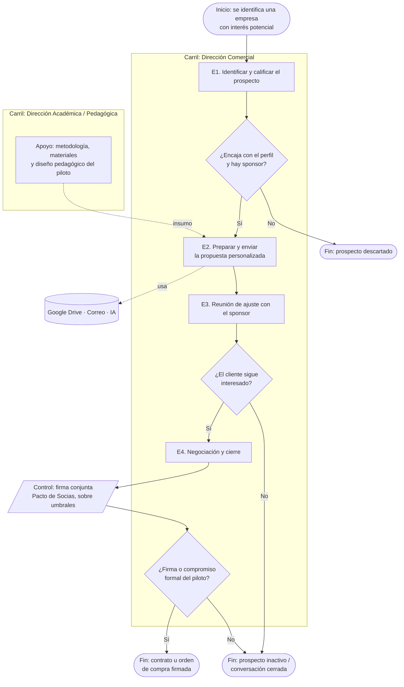

# AlejandrIA — Mapa de Proceso: Captar y cerrar un piloto
### CC5603 – Gestión y Gobernanza de Datos

> Documento de trabajo estructurado según la *Rúbrica – Primer Entregable (Mapa de Procesos)*. Borrador completo para revisión conjunta del equipo antes de convertir a PDF.

---

## Portada
*(Rúbrica: curso, organización, proceso analizado, integrantes, profesor, fecha, versión.)*

- **Curso:** CC5603 – Gestión y Gobernanza de Datos
- **Organización:** AlejandrIA
- **Proceso analizado:** Captar y cerrar un piloto
- **Integrantes del equipo:** Diego Sánchez y Mariano Mora
- **Profesor:** Hugo Beltrán
- **Ayudante:** Luciano Massa Pérez
- **Fecha de entrega:** 07-09-2026
- **Versión del documento:** 1.0.0

---

## 1. Resumen ejecutivo
*(≈ media página. Debe permitir entender el resultado general sin leer todo el informe: organización, proceso seleccionado, por qué es crítico, principales hallazgos, brechas más relevantes, recomendación principal.)*

> **Borrador** (ajustar una vez cerrado el informe completo).

AlejandrIA es una consultoría boutique dedicada a la "formación de formadores" para empresas de minería e industria. Su premisa es que los formadores internos de estas empresas —supervisores, jefes de turno o expertos técnicos ascendidos— son excelentes operadores pero nunca fueron preparados para enseñar, lo que produce capacitación que no llega al puesto de trabajo. Para resolverlo, AlejandrIA toma a ese personal interno y lo transforma en "forjadores" certificados, aplicando una metodología propia basada en la andragogía (la disciplina que estudia cómo aprenden los adultos, a diferencia de la pedagogía, centrada en niños). Además, mide el efecto real de la capacitación mediante un sistema propio de cinco niveles, en lugar de limitarse a registrar asistencia. La organización todavía no tiene clientes pagando y su meta declarada para el trimestre en curso es cerrar su primer piloto.

El proceso crítico analizado es **"Captar y cerrar un piloto"**: el ciclo comercial que va desde que se identifica una empresa industrial con interés potencial hasta que esa empresa firma o compromete formalmente el piloto, o bien el prospecto se descarta. Se eligió porque es el único de los procesos candidatos que ya ocurre y porque constituye el cuello de botella del negocio: mientras no se cierre un primer piloto pagado no se activa el ingreso, no existe un caso institucional real que respalde la venta de los siguientes clientes y no se generan datos reales para calibrar el sistema de medición ni la futura plataforma.

El levantamiento identifica que el proceso opera de forma casi totalmente manual y sin soporte de sistemas. Los principales hallazgos son:

1. No existe ningún sistema de seguimiento comercial —ni CRM ni planilla estructurada—, por lo que el estado de cada prospecto reside en el correo y la memoria de una sola socia.
2. Todo el ciclo comercial depende de una única persona, sin respaldo documentado.
3. No hay un criterio escrito para calificar prospectos ni un precio de piloto acordado entre las socias.
4. La personalización de la propuesta comercial se hace campo por campo sobre una plantilla extensa, siendo el paso más lento y el más expuesto a errores e inconsistencias de versión.
5. Conviven múltiples versiones del mismo documento maestro sin una fuente única de verdad.
6. No hay definiciones compartidas para conceptos clave como "piloto cerrado" ni indicadores medidos del proceso.

Como contexto de gobernanza, el Pacto de Socias sigue siendo un borrador sin firmar y la sociedad no está constituida legalmente.

La recomendación principal es implementar un sistema mínimo y compartido de seguimiento comercial —aunque sea una planilla bien estructurada—, acompañado de un criterio escrito de calificación de prospectos y de un precio único de piloto acordado entre las socias, de modo de reducir la dependencia de una sola persona y dar trazabilidad al proceso antes de escalar a más clientes y de construir el catálogo de datos.

---

## 2. Reseña de la organización
*(≈ media a una página. Actividad principal, productos/servicios, clientes/usuarios/beneficiarios, áreas relacionadas con el proceso, contexto general de uso de datos.)*

**Actividad principal.** AlejandrIA es una consultoría boutique de "formación de formadores" para minería e industria, fundada en 2026 por dos socias que operan de forma remota entre Santiago y Machalí. Su servicio consiste en certificar como "forjadores" a los formadores internos del cliente mediante una metodología propia de andragogía aplicada, y en medir el impacto de esa formación con un sistema propio de cinco niveles. A mediano plazo la visión es evolucionar hacia una plataforma SaaS que automatice parte del proceso; esa plataforma aún no está operativa y el "MVP tecnológico" actual son herramientas de uso general (Google Drive, formularios digitales e IA).

**Productos y servicios.** El modelo comercial vigente es un piloto de 8 a 16 semanas cobrado por hitos (la suscripción anual está diseñada pero depende de tener antes plataforma y clientes activos). Los entregables definidos para un piloto son: diagnóstico de madurez del sistema de formación del cliente con plan de acción priorizado; formación de forjadores; certificación de competencias alineada a ChileValora (perfil "Tutor del Aprendizaje") a través de un Centro Evaluador y Certificador (CEC) aliado; sesiones documentadas con tablero de indicadores; y un caso institucional al cierre, si el cliente lo autoriza. Ninguno se ha entregado aún a un cliente real y pagado: corresponden a la propuesta comercial tipo.

**Clientes y beneficiarios.** El cliente objetivo son empresas contratistas industriales o mineras de 50 a 500 trabajadores (minería, transporte, bodegas). Del lado del cliente participan el sponsor ejecutivo (Gerencia General o VP de Operaciones, que aprueba el piloto), la Gerencia de Personas/Capacitación (contraparte operativa y habitual aprobadora del pago), la Gerencia de Prevención de Riesgos / HSE (valida contenidos críticos de seguridad), las jefaturas de área y los forjadores en formación.

**Áreas relacionadas con el proceso y aliados.** Hoy la organización son las dos socias, con dedicación completa y reparto definido: la Dirección Comercial (María Teresa Peñaloza) lleva estrategia, área comercial y pilotos; la Dirección Académica/Pedagógica (Karina López Fuentealba) lleva operación, metodología, materiales, medición de impacto y coordinación del MVP tecnológico. Las decisiones mayores requieren firma conjunta. El modelo de equipo contempla además un asistente comercial, dos forjadores senior y una diseñadora instruccional, pero ninguno está contratado a la fecha del levantamiento. Externamente, AlejandrIA se apoya en el CEC certificador (alianza formal), en la Universidad Autónoma de Chile como aval académico y en asesores senior de finanzas y ciencias sociales. *(En adelante, el informe se refiere a ambas socias por su rol —Dirección Comercial y Dirección Académica/Pedagógica— y no por su nombre.)*

**Contexto general de uso de datos.** El proyecto se apoya en Google Drive como repositorio (carpetas no estandarizadas, sin fuente única de verdad declarada), en formularios digitales para diagnóstico y evaluación, en una herramienta de IA para redactar documentación y en el correo electrónico para la comunicación con clientes. No existe CRM ni sistema formal de seguimiento comercial, lo que el levantamiento confirma como una brecha.

---

## 3. Definición del proceso crítico

### 3.1 Nombre del proceso
*(Nombre claro, orientado a una acción — ej. "Gestionar matrícula de estudiantes".)*

**Captar y cerrar un piloto.**

### 3.2 Objetivo del proceso
*(Qué resultado busca alcanzar y qué valor entrega al cliente/usuario/beneficiario.)*

Conseguir el primer contrato de piloto pagado con una empresa contratista industrial o minera. Para AlejandrIA, el proceso entrega dos resultados de valor: activa el ingreso de la organización (que hoy no tiene clientes pagando) y genera el primer caso institucional real que respalda la venta de los siguientes clientes. Para la empresa cliente, el resultado es acceder a un diagnóstico de su sistema de formación y a un plan de acción priorizado, con un compromiso acotado en tiempo y costo antes de escalar.

### 3.3 Justificación de su criticidad
*(Impacto en el negocio, frecuencia de ejecución, personas/áreas involucradas, volumen de datos procesados, riesgo operacional o regulatorio, impacto en clientes/usuarios, dependencia de sistemas/proveedores, problemas de calidad de datos existentes.)*

- **Impacto en el negocio.** Es el cuello de botella de AlejandrIA: mientras no se cierre un primer piloto pagado no se activa el ingreso, se consume la caja de arranque (que cubre solo unos pocos meses de operación) y no existe un caso real que sostenga la venta del siguiente cliente. Los demás procesos del negocio (poner en marcha el piloto, medir transferencia a la faena, reportar ROI) no pueden ejecutarse hasta que este cierre.
- **Frecuencia.** Continuo, por oportunidad: no es un proceso periódico sino permanente mientras existan prospectos activos. Hoy hay del orden de una a diez propuestas activas en paralelo (pipeline aproximado, no medido con precisión).
- **Personas y áreas involucradas.** Del lado de AlejandrIA, principalmente la Dirección Comercial, con apoyo de la Dirección Académica/Pedagógica en la personalización de materiales y el diseño del piloto. Del lado del cliente, el sponsor ejecutivo, la Gerencia de Personas/Capacitación y la Gerencia de Prevención de Riesgos / HSE.
- **Volumen de información.** Bajo pero disperso: unas pocas a una decena de propuestas activas, cada una con su ficha de diagnóstico y su propuesta personalizada. No hay una medición precisa del volumen.
- **Riesgo operacional y regulatorio.** En esta etapa comercial el riesgo principal es de confidencialidad del prospecto y de compromisos asumidos sin la firma conjunta que exige el Pacto de Socias. La Ley 21.719 de protección de datos personales aplica una vez que el piloto recoge datos de evaluación de trabajadores, pero eso ocurre fuera del alcance de este proceso.
- **Impacto en el cliente.** Una propuesta mal ajustada o un seguimiento tardío puede significar perder la ventana de decisión del sponsor y la confianza para retomar la conversación más adelante.
- **Dependencia de sistemas y proveedores.** No hay CRM ni sistema formal de seguimiento comercial: el estado de cada prospecto depende del correo y la memoria de una sola persona. La ejecución posterior depende de la alianza con el CEC certificador, pero esa alianza no interviene en la etapa comercial.
- **Problemas de calidad de datos.** En la etapa comercial no hay un registro documentado de problemas de calidad, precisamente porque no hay un registro estructurado del proceso. Sí se observa ambigüedad en definiciones clave ("piloto cerrado", "cliente calificado") y convivencia de varias versiones de los documentos maestros de propuesta.

### 3.4 Alcance
*(Evento que inicia el proceso, evento/resultado que lo finaliza, actividades incluidas, actividades excluidas, áreas y sistemas considerados.)*

- **Evento que inicia el proceso.** Se identifica una empresa contratista industrial o minera con interés potencial en el piloto.
- **Evento o resultado que lo finaliza.** La empresa firma o compromete formalmente el piloto (contrato u orden de compra), o bien el prospecto se descarta o queda inactivo.
- **Actividades incluidas.** Identificar y calificar el prospecto; preparar y enviar la propuesta comercial personalizada; sostener la reunión de ajuste con el sponsor; negociar condiciones; cerrar o descartar.
- **Actividades excluidas.** La ejecución del piloto propiamente tal (selección de forjadores, sesiones de formación, certificación, medición de impacto y reporte de ROI) queda fuera del alcance y corresponde a procesos posteriores.
- **Áreas y sistemas considerados.** Del lado de AlejandrIA, la Dirección Comercial y el apoyo de la Dirección Académica/Pedagógica en materiales, metodología y operación. No se identifica un sistema formal de soporte: se trabaja con Google Drive, correo electrónico, formularios digitales y una herramienta de IA para redacción; la ausencia de un sistema de seguimiento comercial se documenta como brecha.

---

## 4. Metodología de levantamiento
*(Entrevistas realizadas, personas o roles consultados, documentos revisados, sistemas/formularios observados, reuniones de validación, limitaciones del levantamiento. Evitar datos personales innecesarios — identificar solo cargos o roles.)*

**Instrumento principal.** El levantamiento se apoyó en un cuestionario estructurado de levantamiento de proceso, respondido de forma independiente por las dos cofundadoras de AlejandrIA y luego consolidado en una única versión por pregunta. No hubo una reunión formal única de entrevista: cada cofundadora construyó su respuesta revisando la documentación interna del proyecto, y las respuestas se consolidaron integrando las coincidencias y dejando explícitas las diferencias y las brechas.

**Roles consultados.**

- Dirección Comercial: cofundadora a cargo de estrategia, área comercial y pilotos.
- Dirección Académica/Pedagógica: cofundadora a cargo de operación, metodología pedagógica, materiales, medición de impacto y coordinación del desarrollo tecnológico.

**Documentos revisados.** Business Model Canvas del programa de mentorías (Kiltro/OpenBeauchef), Plan de Acción con carta Gantt, Matriz de Riesgos con mapa de calor y KPIs, minutas de sesiones de mentoría, plantilla maestra de propuesta comercial, carta de prospección tipo, catálogo de servicios, borrador del Pacto de Socias, instrumentos de diagnóstico y de validación, y el diagrama de flujo del piloto (ejecución).

**Sistemas y formularios observados.** Google Drive (repositorio de trabajo), formularios digitales de diagnóstico y evaluación, y correo electrónico como canal con clientes. No se observó ningún sistema de seguimiento comercial porque no existe.

**Reuniones de validación.** Pendiente a la fecha de este informe. Se recomienda una reunión conjunta de las dos cofundadoras con el equipo del curso (30–45 min), dado que las dos versiones individuales que originaron el cuestionario consolidado aún no fueron co-validadas entre ellas.

**Limitaciones del levantamiento.**

- No hubo entrevista presencial única; la información proviene de cuestionarios auto-respondidos con apoyo de una herramienta de IA y del cruce de documentación interna.
- Por el acuerdo de confidencialidad, los montos y cifras financieras se describen de forma genérica (rangos o referencias relativas), salvo cuando ya figuran como cifras de referencia en documentos internos.
- Varios datos quedan por confirmar: contratación efectiva de roles presupuestados, identidad del equipo desarrollador mencionado, y umbrales exactos de decisión del Pacto de Socias.
- El proceso no ha llegado nunca a cerrarse con éxito, por lo que varias etapas se describen a partir de cómo están diseñadas y no de casos ejecutados.

---

## 5. Caracterización del proceso
*(Ficha resumen del proceso.)*

| Elemento | Descripción |
|---|---|
| Nombre del proceso | Captar y cerrar un piloto |
| Objetivo | Conseguir el primer contrato de piloto pagado, para activar el ingreso de AlejandrIA y generar el primer caso real que respalde la venta de los siguientes clientes |
| Responsable | Dirección Comercial |
| Cliente o beneficiario | AlejandrIA (recibe el ingreso) y, del lado externo, la empresa contratista industrial o minera prospecto |
| Inicio | Se identifica una empresa con interés potencial en el piloto |
| Fin | Firma o compromiso formal del piloto (contrato u orden de compra), o descarte del prospecto |
| Entradas | Contacto o interés de una empresa; ficha de diagnóstico previo del prospecto; plantilla maestra de propuesta comercial; catálogo de servicios |
| Salidas | Propuesta enviada; reunión agendada; contrato u orden de compra firmada (o registro de descarte, hoy no formalizado) |
| Áreas participantes | Dirección Comercial; apoyo de la Dirección Académica/Pedagógica en materiales, metodología y operación |
| Sistemas utilizados | Google Drive, correo electrónico, formularios digitales y una herramienta de IA para redacción; no hay CRM ni sistema formal de seguimiento |
| Controles | Único control formal: la firma conjunta que el Pacto de Socias exige para compromisos sobre ciertos montos o plazos (documento aún sin firmar). No hay control de calidad ni aprobación interna específica de esta etapa |
| Indicadores | No hay indicadores medidos en la operación real; existen metas de referencia del modelo financiero y del Plan de Acción (p. ej. "3 propuestas enviadas / 1 contrato cerrado" como meta del mes 1), pero son metas, no mediciones |
| Riesgos principales | Dependencia de una sola persona para el ciclo comercial; ausencia de sistema de seguimiento; falta de criterio escrito de calificación de prospectos y de precio acordado entre las socias; sociedad aún no constituida legalmente |
| Frecuencia | Continua, por oportunidad — proceso permanente mientras existan prospectos activos, no periódico |

---

## 6. Descripción del proceso
*(Explicación secuencial de cómo funciona el proceso. La narrativa, la tabla y el diagrama deben coincidir entre sí.)*

**Narrativa.** Hoy el proceso funciona de forma casi totalmente manual. La Dirección Comercial identifica una empresa industrial —típicamente minera o contratista— que podría tener interés, a partir de su red de contactos y de su presencia en espacios como WIM Chile o programas de emprendimiento. Con esa empresa en mente, toma la plantilla maestra de propuesta comercial (un documento de más de diez secciones con campos por completar) y la personaliza a mano: ajusta la parte comercial y de condiciones, mientras la Dirección Académica/Pedagógica apoya con la parte de metodología, materiales y diseño pedagógico del piloto. La propuesta se envía por correo junto con una carta de presentación, y se solicita una reunión breve de ajuste con el sponsor. En esa reunión se afinan alcance, cronograma y condiciones. Si hay interés real, se negocia la inversión y las condiciones de pago (habitualmente la mitad al firmar y la mitad contra entrega), aunque a la fecha las dos socias todavía no han acordado un precio único de piloto, solo un piso de costos y una referencia de ancla.

El seguimiento del estado de cada prospecto no vive en un sistema centralizado, sino en el correo y la memoria de quien lleva lo comercial: si la otra socia necesita saber el estado de un prospecto, tiene que preguntarlo directamente. A la fecha del levantamiento, ningún prospecto ha llegado a la firma.

| Etapa | Responsable | Entrada | Actividad | Control o Decisión | Sistema | Salida |
|---|---|---|---|---|---|---|
| 1. Identificar y calificar el prospecto | Dirección Comercial | Señales de interés o contacto inicial de una empresa industrial | Evaluar si la empresa encaja con el perfil objetivo (contratista minera de 50–500 trabajadores; minería, transporte, bodegas) y si hay un sponsor identificable | Decisión: seguir o descartar. Sin criterio de calificación escrito; es criterio personal de la Dirección Comercial | Correo / red de contactos; sin registro formal | Decisión de preparar propuesta o descartar |
| 2. Preparar y enviar la propuesta personalizada | Dirección Comercial, con apoyo de la Dirección Académica/Pedagógica en materiales, contenidos y diseño del piloto | Plantilla maestra de propuesta, carta tipo y catálogo de servicios | Completar los campos de la plantilla con la información del cliente (diagnóstico, alcance, cronograma, equipo, inversión) y enviarla por correo con la carta | Revisión informal entre ambas socias; no hay punto de aprobación interna formal documentado | Google Drive (edición), correo (envío), IA (redacción) | Propuesta enviada y solicitud de reunión |
| 3. Reunión de ajuste con el sponsor | Dirección Comercial (la Dirección Académica/Pedagógica no participa habitualmente) | Confirmación de reunión y propuesta ya enviada | Presentar y ajustar la propuesta a la realidad del cliente (alcance, cronograma, condiciones) | Decisión: el cliente sigue interesado o no; criterio informal, no escrito | Videollamada o reunión presencial; sin registro formal | Propuesta ajustada o cierre de la conversación |
| 4. Negociación y cierre | Dirección Comercial; los compromisos relevantes requieren acuerdo conjunto de ambas socias | Propuesta ajustada y condiciones finales | Negociar inversión y condiciones de pago; formalizar el compromiso | Decisión: firmar o no firmar. Montos sobre ciertos umbrales requieren firma conjunta (Pacto de Socias). No existe aún un precio de piloto acordado entre las socias | Correo; el contrato quedaría en un archivo sin repositorio confirmado | Contrato u orden de compra firmada, o prospecto inactivo |

---

## 7. Datos relacionados con el proceso
*(Vínculo directo con el futuro catálogo de datos. Como mínimo: datos de entrada, creados, modificados, consultados y de salida; sistemas donde se almacenan; roles que los crean/validan/usan; reglas o controles aplicados; problemas de calidad observados.)*

| Dato o Agrupación de Datos | Descripción | Actividad donde se usa | Origen | Sistema | Responsable | Salida o uso |
|---|---|---|---|---|---|---|
| Nombre y sector de la empresa prospecto | Identificación básica del prospecto | Etapa 1 | Identificación del prospecto por la Dirección Comercial | No confirmado (correo / notas personales) | Dirección Comercial | Personalizar la propuesta |
| Datos de sponsor y contrapartes (nombre, cargo) | Contacto directo del lado del cliente | Etapas 1–3 | Conversaciones y contacto con el cliente | No confirmado | Dirección Comercial | Dirigir la propuesta y coordinar reuniones |
| Diagnóstico inicial del cliente (activos, brechas, riesgos) | Estado del sistema de formación del cliente | Etapa 2 | Conversaciones previas con el cliente | Documento de propuesta (Google Drive) | Dirección Comercial, con apoyo metodológico de la Dirección Académica/Pedagógica | Justificar y ajustar el alcance del piloto |
| Alcance y cronograma del piloto (semanas, forjadores, escala) | Definición del servicio a entregar | Etapas 2–3 | Se define con el cliente sobre la plantilla base | Documento de propuesta (Google Drive) | Ambas socias | Base del acuerdo y del contrato |
| Monto de la inversión y condiciones de pago | Términos económicos del piloto | Etapa 4 | Negociación con el cliente | Documento de propuesta / contrato | Dirección Comercial, con acuerdo conjunto sobre ciertos montos | Facturación y control de caja |
| Estado del prospecto (activo, en negociación, cerrado, caído) | Situación de cada oportunidad en el embudo | Todas las etapas | Se define internamente | No confirmado — brecha identificada (no hay CRM ni planilla) | Dirección Comercial | Saber a quién dar seguimiento |
| Catálogo de servicios y plantilla maestra de propuesta | Insumo base para personalizar cada propuesta | Etapa 2 (insumo) | Trabajo metodológico y comercial interno | Drive personal de la Dirección Académica/Pedagógica — pendiente de subir a la carpeta compartida | Dirección Académica/Pedagógica (metodología) y Dirección Comercial | Base para personalizar cada propuesta |
| Compromiso u orden de compra firmada | Formalización del cierre | Etapa 4 | Resultado del cierre | No confirmado | Ambas socias (firma conjunta si aplica) | Formalizar el inicio del piloto |

**Problemas de calidad de datos observados.**

- **Definiciones no compartidas:** "piloto cerrado" y "cliente calificado" no tienen una definición escrita común (¿compromiso verbal del sponsor?, ¿orden de compra?, ¿contrato firmado?), lo que es un riesgo real dado que el Pacto de Socias exige firma conjunta para ciertos compromisos.
- **Duplicidad de versiones:** conviven varias copias del mismo documento maestro (p. ej. "Documento Maestro Completo" y "…v2"), con archivos temporales y de bloqueo, sin una fuente única de verdad.
- **Datos que existen en un solo lado:** el catálogo de servicios lo mantiene la Dirección Académica/Pedagógica en su equipo y no está subido a la carpeta compartida, por lo que "oficialmente" existe solo para una de las socias.
- **Ausencia de registro de trazabilidad:** no hay historial ni log de decisiones comerciales; el estado de un prospecto no puede consultarse en una fuente confiable y actualizada.
- **Dato que el cliente pide y no se puede entregar:** un caso de cliente real y verificable; mientras tanto se usan casos sectoriales anonimizados.

---

## 8. Diagrama del proceso
*(Se recomienda BPMN 2.0. Debe mostrar inicio y fin, carriles por actor/área, actividades, decisiones y controles, entradas/salidas relevantes, sistemas o repositorios, secuencia lógica, y ser consistente con la descripción escrita.)*

> Versión de trabajo en notación de flujo. La versión ampliada en BPMN 2.0 (con carriles, artefactos de datos y anotaciones de sistema) va en Anexos.

**Elementos para la versión BPMN ampliada (Anexos):**

- **Carriles (pools/lanes):** AlejandrIA → Dirección Comercial y Dirección Académica/Pedagógica; Cliente → sponsor ejecutivo / Gerencia de Personas / HSE (participación en E3–E4).
- **Eventos:** inicio (identificación del prospecto); fin exitoso (piloto firmado); fines alternativos (prospecto descartado / inactivo).
- **Tareas:** E1 identificar y calificar; E2 preparar y enviar propuesta; E3 reunión de ajuste; E4 negociación y cierre.
- **Compuertas (gateways) exclusivas:** ¿califica?; ¿sigue interesado?; ¿firma?.
- **Artefactos de datos:** ficha de diagnóstico, propuesta personalizada, contrato u orden de compra, estado del prospecto (sin repositorio).
- **Repositorios/sistemas:** Google Drive, correo, formularios digitales, herramienta de IA; ausencia de CRM señalada como anotación.
- **Control:** firma conjunta del Pacto de Socias asociada a E4.

---

## 9. Breve diagnóstico
*(Cada hallazgo sigue la lógica: evidencia observada → problema o brecha → impacto en el proceso o en los datos.)*

| # | Evidencia observada | Problema o brecha | Impacto en el proceso o en los datos |
|---|---|---|---|
| 1 | El estado de cada prospecto vive en el correo y la memoria de la Dirección Comercial; la otra socia debe preguntarlo directamente | No existe un sistema ni una planilla de seguimiento comercial (confirmado como brecha, no como duda) | Pérdida de prospectos por falta de seguimiento sistemático; sin visibilidad compartida ni base para priorizar; imposible auditar el embudo |
| 2 | Toda la prospección, propuesta, negociación y cierre recae en una sola persona, sin respaldo documentado | Dependencia de persona en el proceso que genera el ingreso | Si esa persona no está disponible, el proceso se detiene por completo; riesgo de continuidad del negocio |
| 3 | La plantilla maestra de propuesta tiene más de diez secciones con campos que se completan a mano en cada oportunidad | Personalización manual, sin generación asistida ni plantilla dinámica | Es el paso más lento y el más propenso a errores e inconsistencias entre versiones; no escala a varios prospectos simultáneos |
| 4 | Conviven "Documento Maestro Completo" y "…v2", archivos temporales/de bloqueo y una carpeta "por eliminar"; el catálogo de servicios no está en la carpeta compartida | Sin fuente única de verdad ni control de versiones de los documentos base | Retrabajo para confirmar la versión vigente; riesgo de trabajar sobre información desactualizada; un documento clave existe solo para una socia |
| 5 | La calificación de un prospecto es "criterio personal de quien lleva lo comercial"; no hay checklist ni rúbrica | Falta un criterio escrito de calificación de prospectos | Se dedica tiempo desigual a cada oportunidad; decisiones no trazables ni transferibles |
| 6 | Las socias reconocen que solo hay "un piso de costos y una referencia de ancla", no un precio acordado | No hay política de pricing ni precio base del piloto definido entre las socias | Cualquier negociación real puede alargarse o generar compromisos inconsistentes entre ambas |
| 7 | "Piloto cerrado" y "cliente calificado" se entienden distinto según quién los mire | Definiciones de negocio no documentadas ni compartidas | Riesgo de que una socia comprometa algo que la otra no considera "cerrado", en un contexto que exige firma conjunta |
| 8 | El proceso solo se mide con metas del modelo financiero ("3 propuestas / 1 contrato"); no hay medición real | Ausencia de indicadores del proceso (tiempo de ciclo, conversión por etapa, motivo de caída) | No se sabe dónde se pierde el embudo ni cuánto dura realmente el ciclo de venta; no hay base para mejorar |
| 9 | No hay protocolo para prospectos rechazados, caídos o sin respuesta; no se registra el motivo | Falta un procedimiento de cierre/reactivación de oportunidades | Se pierde el aprendizaje comercial; no hay forma de recuperar prospectos fríos de manera ordenada |
| 10 | Antes de enviar la propuesta solo hay "revisión informal"; no hay punto de aprobación interna | Control de calidad insuficiente en la salida al cliente | Riesgo de enviar propuestas con inconsistencias de alcance, precio o cronograma |
| 11 | El Pacto de Socias circula, semanas después de redactado, sin cédulas, capital, fecha de constitución ni umbrales | Gobernanza societaria incompleta; sociedad no constituida legalmente | Cualquier compromiso frente a un cliente descansa sobre una base legal incompleta; los "umbrales de firma conjunta" no son operables |
| 12 | No hay política de datos ni evidencia de respaldos más allá de la sincronización de Google Drive; el NDA no se firma de forma sistemática | Ausencia de gestión de seguridad, acceso y privacidad de la información comercial | Exposición de datos de prospectos; incumplimiento anticipado de la Ley 21.719 cuando el piloto recoja datos de trabajadores |

---

## 10. Recomendaciones
*(Deben derivarse de los hallazgos y ser viables para la organización.)*

| Hallazgo | Recomendación | Beneficio esperado | Prioridad | Responsable sugerido |
|---|---|---|---|---|
| H1, H8 | Implementar una planilla compartida de seguimiento comercial con estados definidos (prospecto, calificado, propuesta enviada, en negociación, cerrado, caído), fecha de último contacto y motivo de caída | Visibilidad compartida del embudo; base para medir conversión y tiempo de ciclo; fin de la dependencia del correo personal | Alta | Dirección Comercial |
| H5 | Redactar un criterio simple de calificación de prospectos (tamaño, sector, existencia de sponsor, presupuesto estimado) como checklist de una página | Decisiones consistentes y transferibles; foco del tiempo en las oportunidades con más probabilidad | Alta | Dirección Comercial |
| H6 | Acordar entre las dos socias un precio base del piloto y un rango de descuento autorizado, y dejarlo por escrito | Negociaciones más rápidas; sin compromisos inconsistentes entre socias | Alta | Ambas socias |
| H7 | Definir por escrito qué cuenta como "piloto cerrado" y "cliente calificado", y publicarlo junto con la planilla de seguimiento | Elimina ambigüedad en un contexto que exige firma conjunta | Alta | Ambas socias |
| H4 | Establecer una única carpeta compartida como fuente de verdad, con convención de nombres y versión, y subir el catálogo de servicios | Menos retrabajo; se evita trabajar sobre versiones desactualizadas | Media | Dirección Académica/Pedagógica |
| H3 | Convertir la plantilla de propuesta en un formato con campos claramente marcados y secciones reutilizables (o generación asistida por IA con revisión humana) | Reduce el tiempo del paso más lento y los errores de personalización; habilita escalar a más prospectos | Media | Dirección Académica/Pedagógica |
| H2 | Documentar el ciclo comercial (este mapa) y construir el canal comercial de la segunda socia para tener respaldo | Reduce la dependencia de una sola persona en el proceso que genera el ingreso | Media | Ambas socias |
| H10 | Definir un checkpoint de revisión conjunta breve antes de enviar cada propuesta (checklist de alcance, precio y cronograma) | Menos inconsistencias en lo que llega al cliente | Media | Dirección Comercial |
| H9 | Incluir en la planilla un procedimiento simple de cierre y reactivación de prospectos (motivo de caída, fecha de recontacto) | Se conserva el aprendizaje comercial; recuperación ordenada de prospectos fríos | Baja | Dirección Comercial |
| H11 | Completar y firmar el Pacto de Socias (cédulas, capital, fecha de constitución, umbrales) y constituir la sociedad | Base legal válida para comprometer a "la empresa" frente a un cliente | Alta | Ambas socias (con asesoría legal) |
| H12 | Definir una política mínima de datos y accesos para la información comercial y de prospectos, y firmar el NDA de forma sistemática; preparar el marco para la Ley 21.719 antes de ejecutar un piloto | Protección de datos de prospectos; cumplimiento anticipado antes de manejar datos de trabajadores | Media | Ambas socias |

---

## 11. Conclusiones
*(Relevancia del proceso, principales brechas, datos críticos identificados, relación entre el proceso y el futuro catálogo de datos, prioridades de mejora.)*

"Captar y cerrar un piloto" es el proceso que sostiene la viabilidad inmediata de AlejandrIA: es el único de los procesos candidatos que ya ocurre y el que debe producir el primer ingreso y el primer caso real de cliente. Su correcto funcionamiento condiciona a todos los procesos posteriores (ejecución del piloto, medición de transferencia y reporte de ROI), que hoy no pueden activarse.

El levantamiento muestra un proceso que funciona por criterio y memoria de una sola persona, sin sistema de soporte, sin criterios escritos y sin medición. Las brechas más relevantes son la ausencia de un sistema de seguimiento comercial, la dependencia de persona en todo el ciclo, la falta de un criterio de calificación y de un precio de piloto acordado, la convivencia de versiones sin fuente única de verdad, y una gobernanza societaria todavía incompleta.

Los datos críticos del proceso —estado del prospecto, ficha de diagnóstico del cliente, alcance y cronograma del piloto, condiciones económicas y compromiso firmado— hoy no tienen un sistema, un responsable formal ni reglas de calidad claros. Esto conecta directamente con el futuro catálogo de datos: antes de catalogar, AlejandrIA necesita definir estos datos, dónde viven, quién los mantiene y qué significa cada estado, porque hoy varios de ellos existen solo en el correo de una persona o en definiciones no compartidas.

Las prioridades de mejora, en orden, son: (1) instalar la planilla compartida de seguimiento con estados y definiciones escritas; (2) acordar criterio de calificación y precio base del piloto entre las socias; (3) ordenar el repositorio en una fuente única de verdad; y (4) cerrar la gobernanza societaria (Pacto de Socias firmado y sociedad constituida). Con esas bases, el proceso queda en condiciones de escalar y de alimentar el catálogo de datos.

---

## 12. Anexos
*(Diagrama en tamaño ampliado, pauta de entrevistas, lista de roles entrevistados, evidencias documentales, glosario de términos y siglas, inventario preliminar de datos, versiones o validaciones del proceso.)*

**A. Diagrama del proceso en tamaño ampliado (BPMN 2.0).** `[Pendiente: exportar desde herramienta BPMN a partir de los elementos listados en la Sección 8.]`

**B. Instrumento de levantamiento.** Cuestionario estructurado de levantamiento de proceso (versión consolidada), con los bloques 0 a 12.

**C. Roles consultados.**

- Dirección Comercial (cofundadora): estrategia, área comercial y pilotos.
- Dirección Académica/Pedagógica (cofundadora): operación, metodología, materiales, medición de impacto, coordinación del MVP tecnológico.

**D. Evidencias documentales revisadas.** Business Model Canvas (Kiltro/OpenBeauchef), Plan de Acción con carta Gantt, Matriz de Riesgos con mapa de calor y KPIs, minutas de sesiones de mentoría, plantilla maestra de propuesta comercial, carta de prospección tipo, catálogo de servicios, borrador del Pacto de Socias, instrumentos de diagnóstico y validación, diagrama de flujo del piloto (ejecución).

**E. Glosario de términos y siglas.**

| Término | Significado |
|---|---|
| Forjador | Formador interno de la empresa cliente (supervisor, jefe de turno, experto técnico) que AlejandrIA forma y certifica para transferir conocimiento en la faena |
| Forjador senior | Rol previsto en el modelo de equipo de AlejandrIA: facilitador experimentado que dictaría la formación; no contratado a la fecha |
| Andragogía | Disciplina que estudia cómo aprenden las personas adultas, a diferencia de la pedagogía (centrada en niños) |
| Sistema de medición de 5 niveles | Método propio de AlejandrIA para medir el impacto real de la capacitación, más allá de la asistencia |
| CEC | Centro Evaluador y Certificador autorizado; certifica competencias en el marco de ChileValora |
| ChileValora | Sistema nacional de certificación de competencias laborales; perfil aplicable: "Tutor del Aprendizaje" |
| Sponsor ejecutivo | Autoridad del cliente (Gerencia General o VP de Operaciones) que aprueba el piloto |
| HSE | Health, Safety & Environment; gerencia de prevención de riesgos que valida contenidos críticos de seguridad |
| APR | Asesor en Prevención de Riesgos |
| Piloto | Servicio acotado de 8 a 16 semanas, cobrado por hitos; unidad comercial actual de AlejandrIA |
| MVP | Producto mínimo viable; hoy es un conjunto de herramientas de uso general (Drive, formularios, IA), no una plataforma |
| SaaS | Software as a Service; modelo de plataforma al que AlejandrIA aspira a mediano plazo |
| Pacto de Socias | Documento que define gobernanza, reparto y decisiones de firma conjunta entre las dos socias; en borrador, sin firmar |
| Pipeline / embudo | Conjunto de oportunidades comerciales activas en distintas etapas |
| Runway | Meses de operación que cubre la caja de arranque antes de necesitar nuevos ingresos |
| Ley 21.719 | Ley chilena de protección de datos personales; aplica cuando el piloto recoge datos de evaluación de trabajadores |
| WIM Chile | Women in Mining Chile; red del sector minero usada como canal de contacto |

**F. Inventario preliminar de datos.** Ver tabla de la Sección 7 (base para el futuro catálogo de datos).

**G. Versiones y validaciones del proceso.** Versión 1.0.0 de este informe, construida a partir del cuestionario consolidado. Validación conjunta de las dos cofundadoras con el equipo del curso: pendiente de agendar.

---

## Notas de control (no forma parte del informe final)
- **Extensión recomendada:** informe principal 8–12 páginas (PDF); diagrama en 1 página dentro del informe + versión ampliada en anexos.
- **Requisitos mínimos para que sea evaluable:** definición y alcance del proceso, identificación de actores, entradas/actividades/controles/salidas, diagrama legible, identificación preliminar de datos, diagnóstico, conclusiones, recomendaciones, evidencia de validación con una contraparte de la organización.
- **Pendientes antes de entregar:**
  1. Diagrama BPMN 2.0 ampliado (Anexo A) exportado desde herramienta.
  2. Reunión de validación con las dos cofundadoras y registro de la evidencia (Anexo G).
  3. Ajuste final del resumen ejecutivo (Sección 1) una vez cerrado el informe.
  4. Número de equipo en el nombre del archivo: `E1_ProcesoCritico_AlejandrIA_EquipoXX.pdf`.
- **Pregunta transversal que el informe debe responder:** ¿cómo funciona el proceso, quiénes participan, qué datos utiliza y genera, dónde están sus principales brechas y qué debería mejorarse antes de construir el catálogo de datos?
