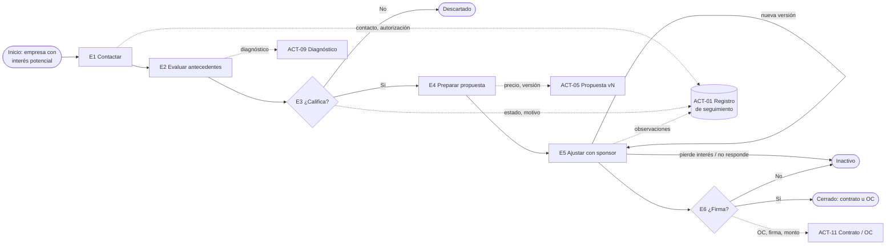
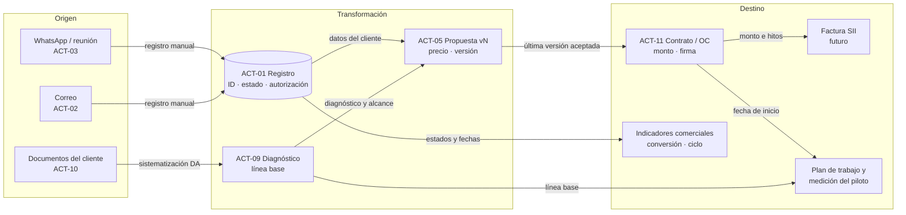

# AlejandrIA — Catálogo de Datos: Captar y cerrar un piloto
### CC5603 – Gestión y Gobernanza de Datos

> Documento de trabajo estructurado según la *Rúbrica – Segundo Entregable (Catálogo de Datos)*. Borrador completo para revisión conjunta del equipo antes de convertir a PDF. Construido a partir del informe del primer entregable (mapa de proceso), del *Cuestionario complementario – Catálogo de Datos* respondido por las dos cofundadoras (28-09-2026) y de la *Plantilla de datos por etapa v3* (clasificación según Ley 21.719).

---

## Portada
*(Rúbrica: curso, organización, proceso analizado, integrantes, profesor, ayudante, fecha, versión.)*

- **Curso:** CC5603 – Gestión y Gobernanza de Datos
- **Organización:** AlejandrIA
- **Proceso analizado:** Captar y cerrar un piloto
- **Integrantes del equipo:** Diego Sánchez y Mariano Mora
- **Profesor:** Hugo Beltrán Alejos
- **Ayudante:** Luciano Massa Pérez
- **Fecha de entrega:** `[por confirmar]`
- **Versión del documento:** 1.0.0

---

## 1. Resumen ejecutivo
*(Empresa, proceso crítico, problema relacionado con los datos, alcance del catálogo, principales resultados, recomendaciones. Debe entenderse sin leer todo el informe.)*

**Organización.** AlejandrIA es una consultoría boutique de "formación de formadores" para empresas contratistas de minería e industria, fundada en 2026 por dos socias (Dirección Comercial y Dirección Académica/Pedagógica). Aún no tiene clientes pagando; su meta inmediata es cerrar el primer piloto.

**Proceso crítico.** *Captar y cerrar un piloto*: desde que se identifica una empresa con interés potencial hasta que firma el piloto (contrato u orden de compra) o el prospecto se descarta o queda inactivo. Es el cuello de botella del negocio: sin él no hay ingreso ni caso real que respalde las siguientes ventas.

**Problema relacionado con los datos.** Los datos del proceso existen, pero sin contexto ni dueño formal. El estado de cada prospecto vive en el correo, el WhatsApp y la memoria de la Dirección Comercial. La información se copia a mano de la conversación a la propuesta y de ahí al contrato, sin un registro que conecte esos pasos. Conviven varias versiones de los documentos maestros sin una oficial, y conceptos clave como "piloto cerrado" o los estados del prospecto se definen de forma distinta según la fuente. Los errores se detectan por accidente, no por revisión.

**Alcance del catálogo.** Un solo proceso (6 etapas) y **13 activos de datos**: 8 documentos y repositorios en uso, 2 fuentes informales (correo y agenda/WhatsApp) que hoy funcionan como "sistema", 2 activos propuestos (el registro de seguimiento comercial y el contrato u OC, que aún no tiene casos) y 1 que se menciona pero no existe (el NDA). Debajo de ellos se documentan **74 campos**. De ellos se priorizan **7 Elementos Críticos de Datos (CDE)**, menos del 10 % del total.

**Principales resultados.**
1. Ficha completa por activo con las 8 dimensiones de la rúbrica: identificación, negocio, técnico, operacional, gobierno, calidad, seguridad y trazabilidad.
2. Siete CDE justificados según la decisión que soportan y el riesgo de error: ID del prospecto, estado del prospecto, monto acordado, versión vigente de la propuesta, evidencia de cierre, autorización de datos personales y línea base del indicador del cliente. Cada uno tiene reglas de calidad medibles, umbrales y controles.
3. Modelo de roles (Owner, Steward, Custodian, consumidores) adaptado a una organización de dos personas.
4. Clasificación de seguridad alineada con la Ley 21.719 (vigencia plena el 01-12-2026). La mitad de los campos son datos personales de contactos del cliente; ninguno es dato sensible.
5. Linaje de los CDE y un ciclo de mantenimiento del catálogo.
6. Ocho incidencias de calidad documentadas.

**Recomendaciones principales.** (1) Poner en marcha el registro de seguimiento comercial (ACT-01) como fuente única del estado del prospecto, con listas de valores cerradas. (2) Aprobar por escrito un glosario mínimo: "piloto cerrado", "descartado", "inactivo" y la lista oficial de estados. (3) Declarar una versión oficial por documento y una convención de nombres en la carpeta compartida. (4) Registrar la autorización de uso de datos de cada contacto antes del 01-12-2026. (5) Revisar el catálogo cada mes mientras el proceso esté en marcha, y además ante cada cambio importante.

---

## 2. Descripción del proceso crítico
*(Objetivo, inicio y término, entradas, actividades principales, controles, sistemas participantes, salidas, actores y responsables, consumidores de información. Evidencia esperada: mapa del proceso validado y su relación con los datos.)*

> **Actualización respecto del primer entregable.** El mapa del E1 tenía 4 etapas. Con el cuestionario de catálogo y la plantilla v3, el cliente desagregó la primera etapa ("Identificar y calificar") en tres: contactar, evaluar antecedentes y calificar. Este informe usa las **6 etapas** de la plantilla v3, que son las que las socias usan hoy para organizar los datos.

| Elemento | Descripción |
|---|---|
| **Objetivo** | Conseguir el primer contrato de piloto pagado (8 a 16 semanas, cobrado por hitos) con una empresa contratista industrial o minera de 50 a 500 trabajadores. Esto activa el ingreso y genera el primer caso institucional real. |
| **Inicio** | Se identifica una empresa con interés potencial y se toma contacto con una persona de ella (normalmente por WhatsApp o correo). |
| **Término** | (a) **Cerrado:** contrato firmado por ambas partes u orden de compra emitida, con fecha de inicio fijada. (b) **Descartado:** el prospecto dice que no después de la primera reunión o no lleva a un tomador de decisión (lo deciden las socias). (c) **Inactivo:** el prospecto deja de responder. |
| **Entradas** | Datos básicos del contacto (los entrega el propio contacto); antecedentes de la empresa (dotación, faena, riesgos, forma de capacitar, presupuesto, documentos); plantilla maestra de propuesta; catálogo de servicios; carta y correo tipo; paquete del piloto. |
| **Actividades principales** | **E1. Contactar a la empresa:** verificar el encaje con el perfil y a quién dirigirse; primera reunión, sin compartir información técnica. **E2. Evaluar antecedentes:** la socia académica arma el diagnóstico inicial. **E3. Calificar:** decidir si se prepara una propuesta; identificar al sponsor, que es el tomador de decisión. **E4. Preparar la propuesta:** escala, duración, servicios, entregables, precio e hitos de pago. **E5. Ajustar con el sponsor:** ciclo de observaciones y nuevas versiones, que puede repetirse. **E6. Negociar y cerrar:** inversión, forma de pago, datos de facturación, firma. |
| **Controles** | Todos son informales. Decisión de calificación según criterio no escrito (tamaño, sector, sponsor, presupuesto). Revisión mínima de la plantilla antes de enviar: datos del cliente, alcance, cronograma, inversión y condiciones, sin checklist. Los descuentos relevantes y los compromisos importantes los acuerdan ambas socias (firma conjunta del Pacto de Socias, todavía en borrador). No hay controles de calidad de datos. |
| **Sistemas participantes** | Google Drive (carpeta compartida del proyecto), correo electrónico, WhatsApp y agenda telefónica personales, Word/PDF, formularios digitales (diagnóstico de madurez) y una herramienta de IA para redactar (lo generado se sube luego al Drive). No hay CRM ni planilla de seguimiento. |
| **Salidas** | Diagnóstico inicial (también le sirve al cliente para ver sus brechas); propuesta personalizada (vN); contrato u orden de compra; fecha de inicio comprometida; o bien registro de descarte o inactividad (hoy no se registra). |
| **Actores y responsables** | **Dirección Comercial:** identifica prospectos, arma la propuesta, se reúne con el sponsor, negocia y cierra; responsable del proceso. **Dirección Académica/Pedagógica:** diagnóstico inicial, materiales y metodología; reemplaza a la comercial si es urgente. **Cliente:** contacto inicial (puente), sponsor o tomador de decisión (Gerencia General o VP de Operaciones), Gerencia de Personas/Capacitación, HSE, contacto de facturación y firmantes. |
| **Consumidores de información** | Ambas socias (seguimiento, precio, planificación de inicio); el sponsor y la contraparte del cliente (propuesta y diagnóstico); a futuro, el SII y la contabilidad (factura, que requiere constituir la SpA o emitir boleta de honorarios), la operación del piloto (plan de trabajo, línea base) y el equipo del curso (catálogo). |

**Diagrama del proceso con sus datos** (versión ampliada en el Anexo C):

**Relación del proceso con los datos.** Cada etapa toma datos del cliente, los transforma en una decisión y genera datos propios (ver el resumen "pedimos / hacemos / generamos" por etapa en el Anexo A). Las decisiones de avance (E3, E5, E6) dependen hoy de datos que no están registrados en ningún lado (estado, nivel de interés, número de rondas), y por eso el catálogo prioriza esos datos.

---

## 3. Alcance del catálogo
*(Proceso incluido, subprocesos, sistemas, activos incluidos, periodo analizado, exclusiones, supuestos y restricciones. También usuarios y propósito del catálogo.)*

| Elemento | Definición |
|---|---|
| **Propósito del catálogo** | Que cualquiera de las dos socias, o un tercero como un futuro asistente comercial, pueda responder sin preguntarle a nadie: *¿en qué estado está cada prospecto, dónde está el documento vigente, qué significa cada dato, quién responde por él y si se puede compartir?* |
| **Usuarios del catálogo** | Las dos socias (uso diario); futuro asistente comercial (inducción); asesoría legal (Ley 21.719); equipo del curso (evaluación). |
| **Proceso incluido** | *Captar y cerrar un piloto*. |
| **Subprocesos considerados** | E1 Contactar · E2 Evaluar antecedentes · E3 Calificar · E4 Preparar propuesta · E5 Ajustar con el sponsor · E6 Negociar y cerrar. |
| **Sistemas involucrados** | Google Drive (carpeta compartida), correo electrónico, WhatsApp y agenda telefónica de la Dirección Comercial, formularios digitales, herramienta de IA (solo como paso intermedio de redacción). |
| **Activos incluidos** | 13 activos (ACT-01 a ACT-13, Sección 4.2) y 74 campos (Anexo A). |
| **Periodo analizado** | Situación vigente al 28-09-2026 (fecha de respuesta del cuestionario), considerando la operación comercial desde la fundación (2026). Pipeline aproximado de 1 a 10 propuestas activas; ningún piloto cerrado. |
| **Exclusiones** | (1) Ejecución del piloto: selección de forjadores, sesiones, certificación con el CEC, medición de impacto en 5 niveles y ROI. (2) Datos de trabajadores del cliente y evaluaciones; solo se cataloga el riesgo de recibirlos por error. (3) Finanzas, contabilidad y facturación posteriores a la firma. (4) Gobierno societario (Pacto de Socias, constitución de la SpA), salvo como control del cierre. (5) Material de investigación y *customer discovery*. (6) La futura plataforma SaaS. |
| **Supuestos** | (a) Como ningún prospecto ha llegado al cierre, E5 y E6 se catalogan según su diseño y no a partir de casos reales. (b) Los campos marcados como "campo nuevo" en la plantilla v3 se catalogan con estado *Propuesto*. (c) Las clasificaciones según la Ley 21.719 son una propuesta base y deben validarse con asesoría legal. |
| **Restricciones** | (a) El equipo no tuvo acceso directo a la carpeta de Drive: las rutas y nombres exactos de archivo quedan marcados `[por confirmar]`. (b) Por confidencialidad, los montos se describen como tipo y formato, sin cifras. (c) Organización de dos personas: los roles de gobierno necesariamente se concentran (ver 4.4). |

**Criterio de priorización.** No se catalogan todos los datos de la organización. Entran solo los activos que **se leen o se escriben en alguna de las 6 etapas** y los campos que la plantilla v3 identifica como necesarios para decidir o controlar el proceso.

---

## 4. Catálogo de datos

### 4.1 Convenciones del catálogo
*(Para que una persona ajena al equipo pueda leerlo de forma autónoma.)*

- **Códigos:** `ACT-NN` = activo de datos · `CDE-NN` = elemento crítico de datos · `RC-NN` = regla de calidad · `INC-NN` = incidencia de calidad.
- **Roles:** **DC** = Dirección Comercial · **DA** = Dirección Académica/Pedagógica · **AS** = ambas socias (decisión conjunta).
- **Estado del activo:** *Activo* (existe y se usa) · *Informal* (existe pero no debería ser fuente oficial; se propone migrarlo) · *Propuesto* (definido, aún no existe) · *Inexistente* (se menciona, pero no hay archivo).
- **Escala de clasificación de seguridad:**

| Nivel | Significado | Ejemplo en el proceso |
|---|---|---|
| **Público** | Puede difundirse sin restricción | Flyer, carta por sector |
| **Interno** | Uso de las socias; no contiene datos de clientes | Plantilla maestra, catálogo de servicios |
| **Confidencial – comercial** | Información de la empresa cliente o económica de AlejandrIA; protegida por contrato o NDA, no por la Ley 21.719 | Precio, presupuesto del cliente, riesgos críticos de su operación |
| **Confidencial – dato personal** | Identifica a una persona natural, directamente o por estar vinculado a ella (Ley 21.719, art. 2 f) | Nombre, cargo, correo y teléfono del contacto; estado del prospecto |
| **Sensible** | Dato sensible (art. 2 g: salud, etc.) | Ningún campo lo pide; riesgo en documentos que envía el cliente |

> **Catalogar no es autorizar el acceso.** Que un activo aparezca aquí no da derecho a ver su contenido; el acceso lo define el Owner (Sección 4.5).

### 4.2 Inventario de activos

| Código | Activo | Tipo | Etapas | Estado | Owner | Clasificación | ¿Tiene CDE? |
|---|---|---|---|---|---|---|---|
| ACT-01 | Registro de seguimiento comercial (planilla de prospectos) | Planilla / base de datos | E1–E6 | Propuesto | DC | Conf. – dato personal | Sí (CDE-01, 02, 06) |
| ACT-02 | Buzón de correo de la Dirección Comercial | Repositorio de mensajes | E1–E6 | Activo (fuente de facto) | DC | Conf. – dato personal | Fuente actual |
| ACT-03 | Agenda telefónica, WhatsApp y notas personales de la DC | Repositorio informal | E1, E3, E5 | Informal | DC | Conf. – dato personal | Fuente actual |
| ACT-04 | Plantilla maestra de propuesta comercial | Documento plantilla (Word) | E4 | Activo | DC | Interno | No |
| ACT-05 | Propuesta comercial personalizada (por prospecto, vN) | Documento (Word/PDF) | E4–E6 | Activo | DC | Conf. – comercial | Sí (CDE-03, 04) |
| ACT-06 | Catálogo comercial de servicios | Documento (Word/PDF) | E4 | Activo | DA | Interno | No |
| ACT-07 | Carta y correo de prospección tipo | Documento plantilla (Word) | E1, E4 | Activo | DC | Interno | No |
| ACT-08 | Paquete del piloto (carta por sector, flyer, hoja de ruta, diagrama de flujo, protocolo de cierre) | Conjunto de documentos | E1, E4 | Activo | DC | Público / Interno | No |
| ACT-09 | Diagnóstico inicial del prospecto (incluye planilla de evaluación de madurez) | Documento + formulario | E2–E4 | Activo (parcial) | DA | Conf. – comercial | Sí (CDE-07) |
| ACT-10 | Documentos recibidos del cliente | Archivos del cliente | E2 | Activo | Cliente (titular) / DA | Conf. – comercial; riesgo de dato sensible | No |
| ACT-11 | Contrato de piloto / orden de compra | Documento legal | E6 | Propuesto (ninguno firmado) | AS | Conf. – comercial + personal (firmantes) | Sí (CDE-03, 05) |
| ACT-12 | Acuerdo de confidencialidad (NDA) | Documento legal | E1–E6 | Inexistente | AS | Interno (plantilla) / Conf. (firmado) | No |
| ACT-13 | Estándar de datos por etapa (Plantilla v3, Ley 21.719) | Diccionario / estándar de metadatos | Transversal | Activo (v3) | AS | Interno | Define todos |

### 4.3 Fichas de activos
*(Cada ficha cubre las 8 dimensiones mínimas de la rúbrica. El detalle campo por campo de cada activo está en el Anexo A.)*

#### ACT-01 · Registro de seguimiento comercial
| Dimensión | Metadatos |
|---|---|
| Identificación | **Código:** ACT-01 · **Tipo:** planilla estructurada (futura base de un CRM) · **Descripción:** registro único con una fila por oportunidad comercial. Reúne la identificación del prospecto, sus contactos, su estado, fechas, próxima acción y motivo de caída. |
| Negocio | **Definición:** fuente oficial del estado de cada prospecto en el embudo comercial. **Propósito:** saber en qué está cada oportunidad sin preguntarle a la DC, priorizar el seguimiento y medir conversión y tiempo de ciclo. **Reglas:** una fila por empresa, identificada por ID y RUT; el estado solo toma valores de la lista oficial (Anexo B); todo prospecto caído lleva un motivo. **Términos relacionados:** prospecto, sponsor, estado, descartado, inactivo, piloto cerrado. **Ejemplo de uso:** el lunes, la DA filtra "En ajuste" con *próxima acción* vencida y sabe a quién llamar. |
| Técnico | **Sistema:** Google Sheets en la carpeta compartida del proyecto (propuesta) · **Archivo:** `Registro_Prospectos_AlejandrIA` `[ruta por confirmar]` · **Hojas:** `Prospectos` (1 fila por oportunidad), `Contactos` (1 fila por persona), `Historial` (1 fila por cambio de estado) · **Campos:** ID del prospecto (texto `AA-AAAA-NNN`), RUT (texto `12.345.678-9`), estado (lista), fechas (`dd-mm-aaaa`), etc. Esquema completo en el Anexo A. |
| Operacional | **Frecuencia:** se actualiza en cada contacto o cambio de estado (evento). **Disponibilidad:** en línea para ambas socias. **Vigencia:** histórico permanente para cerrados; datos personales de prospectos caídos se anonimizan a los 12 meses (propuesta). **Estado:** *Propuesto*. Hoy estos datos viven en ACT-02 y ACT-03. |
| Gobierno | **Owner:** DC · **Steward:** DC (registra); revisora: DA (control mensual) · **Custodian:** titular de la cuenta de Google Workspace/Drive `[por confirmar]`; Google como proveedor de infraestructura. |
| Calidad | **Reglas:** RC-01 a RC-08 (Sección 5.2). **Indicadores:** % de filas con estado válido; % de prospectos activos con contacto en los últimos 30 días; duplicados por RUT. **Umbrales:** 100 % / ≥ 90 % / 0. **Incidencias:** INC-05 (estados inconsistentes entre fuentes). |
| Seguridad | **Clasificación:** Confidencial – dato personal (contactos del cliente y datos vinculados). **Sensibilidad:** media; sin datos sensibles. **Restricciones:** acceso solo para las socias, con permiso de edición nominativo; no se comparte con el cliente; no se carga a herramientas de IA con nombres o correos (usar el ID). |
| Trazabilidad | **Origen:** conversaciones (WhatsApp, correo, reuniones) y formularios del cliente. **Transformaciones:** registro manual y normalización a listas y formatos. **Destino:** propuesta (ACT-05), contrato (ACT-11), indicadores comerciales. **Consumidores:** DC, DA y el futuro asistente comercial. |

#### ACT-02 · Buzón de correo de la Dirección Comercial
| Dimensión | Metadatos |
|---|---|
| Identificación | **Código:** ACT-02 · **Tipo:** repositorio de mensajes · **Descripción:** casilla de correo con la que la DC se comunica con los prospectos; hoy es la fuente de facto de contactos, observaciones, envíos de propuesta y OC. |
| Negocio | **Definición:** registro de las comunicaciones escritas con cada prospecto. **Propósito:** enviar información, hacer seguimiento y respaldar lo acordado. **Reglas:** ninguna formal. **Términos:** fecha de envío de la propuesta (= fecha del correo), observaciones del cliente. **Ejemplo:** para saber cuándo se envió la v2 de una propuesta, hoy hay que buscar el correo. |
| Técnico | **Sistema:** Gmail (Google) · **Estructura:** hilos por prospecto, sin etiquetas estandarizadas · **Formato:** mensajes con adjuntos `.docx`/`.pdf`. |
| Operacional | **Frecuencia:** continua · **Disponibilidad:** solo para la DC · **Vigencia:** sin política de retención · **Estado:** *Activo*, como fuente no oficial. |
| Gobierno | **Owner:** DC · **Steward:** DC · **Custodian:** Google (proveedor de Gmail); la DC como titular de la cuenta. |
| Calidad | **Regla:** todo dato que defina el estado de un prospecto debe pasarse a ACT-01 en 48 h hábiles (RC-04). **Indicador:** % de cambios de estado con fila en `Historial`. **Umbral:** ≥ 95 %. **Incidencias:** la información queda dispersa y no la puede consultar la DA. |
| Seguridad | **Clasificación:** Confidencial – dato personal · **Restricciones:** cuenta personal, no compartida; no reenviar hilos con datos de contacto a terceros. |
| Trazabilidad | **Origen:** prospecto y DC · **Transformación:** copia manual hacia propuesta y contrato · **Destino:** ACT-01, ACT-05, ACT-11 · **Consumidores:** DC. |

#### ACT-03 · Agenda telefónica, WhatsApp y notas personales de la DC
| Dimensión | Metadatos |
|---|---|
| Identificación | **Código:** ACT-03 · **Tipo:** repositorio informal · **Descripción:** teléfonos, conversaciones de WhatsApp y apuntes de la DC sobre prospectos (nivel de interés, quién decide, próximos pasos). |
| Negocio | **Definición:** canal del primer contacto. Según el cuestionario, el prospecto entrega su número de WhatsApp y su correo. **Propósito:** coordinar reuniones. **Reglas:** ninguna. **Términos:** contacto, sponsor, nivel de interés. **Ejemplo:** el "nivel de interés" de un prospecto hoy solo está en la memoria de la DC. |
| Técnico | **Sistema:** teléfono móvil personal (agenda, WhatsApp) y notas · **Formato:** no estructurado. |
| Operacional | **Frecuencia:** continua · **Disponibilidad:** solo la DC · **Vigencia:** indefinida · **Estado:** *Informal*; se propone dejar de usarlo como fuente y pasar sus datos a ACT-01. |
| Gobierno | **Owner:** DC · **Steward:** DC · **Custodian:** la propia DC (dispositivo personal, sin respaldo institucional). |
| Calidad | **Regla:** mismo traspaso a ACT-01 (RC-04). **Incidencias:** datos que solo una persona conoce (dependencia de persona, E1-H2). |
| Seguridad | **Clasificación:** Confidencial – dato personal · **Riesgo:** pérdida o robo del dispositivo; mezcla con contactos personales. |
| Trazabilidad | **Origen:** prospecto · **Destino:** ACT-01 · **Consumidores:** DC. |

#### ACT-04 · Plantilla maestra de propuesta comercial
| Dimensión | Metadatos |
|---|---|
| Identificación | **Código:** ACT-04 · **Tipo:** documento plantilla · **Descripción:** documento Word de más de 10 secciones con campos por completar (datos del cliente, diagnóstico, alcance, cronograma, equipo, inversión, condiciones), base de toda propuesta. |
| Negocio | **Definición:** modelo oficial a partir del cual se genera cada propuesta personalizada. **Propósito:** asegurar contenido y condiciones homogéneas. **Reglas:** la propuesta solo se envía con todos los campos mínimos completos (E2 del cuestionario). **Términos:** escala del piloto, hitos de pago, vigencia. **Ejemplo:** se copia la plantilla, se renombra con el ID del prospecto y se completa. |
| Técnico | **Sistema:** Google Drive, carpeta compartida · **Archivo:** `[nombre de la versión oficial por confirmar]` · **Formato:** `.docx`. |
| Operacional | **Frecuencia de uso:** una vez por propuesta · **Actualización:** ad hoc, sin calendario · **Disponibilidad:** ambas socias · **Estado:** *Activo*; **sin versión oficial declarada** (INC-01). |
| Gobierno | **Owner:** DC (contenido comercial) · **Steward:** DA (secciones metodológicas y control de versión) · **Custodian:** titular de la carpeta compartida. |
| Calidad | **Regla:** existe una única versión marcada como `OFICIAL` en la carpeta (RC-09). **Indicador:** número de copias vigentes. **Umbral:** 1. **Incidencia:** INC-01. |
| Seguridad | **Clasificación:** Interno · **Restricciones:** no se comparte en blanco con prospectos. |
| Trazabilidad | **Origen:** trabajo comercial y metodológico interno · **Destino:** ACT-05 · **Consumidores:** ambas socias. |

#### ACT-05 · Propuesta comercial personalizada
| Dimensión | Metadatos |
|---|---|
| Identificación | **Código:** ACT-05 · **Tipo:** documento por prospecto, versionado · **Descripción:** propuesta enviada a un prospecto con diagnóstico, escala, duración, participantes, modalidad, servicios, entregables, precio, hitos de pago, versión y vigencia. |
| Negocio | **Definición:** oferta formal y acotada de AlejandrIA a un prospecto calificado. **Propósito:** que el sponsor decida. **Reglas:** se envía siempre la versión vigente; los descuentos relevantes requieren acuerdo de ambas socias; vencida la vigencia, se evalúa si el prospecto sigue activo. **Términos:** escala (corto / medio / amplio), sponsor, ronda de ajuste. **Ejemplo:** "v3" es la tercera versión enviada después de dos rondas de observaciones. |
| Técnico | **Sistema:** Google Drive (edición) y correo (envío) · **Archivo:** `[ID]_Propuesta_v[N].docx` / `.pdf` (convención propuesta) · **Campos clave:** precio total neto (CLP, entero), hitos de pago (hito + %), descuento (%), versión (`vN`), fecha de envío y vigencia (`dd-mm-aaaa`). |
| Operacional | **Frecuencia:** 1 a N versiones por prospecto · **Actualización:** después de cada ronda de ajuste · **Disponibilidad:** ambas socias · **Vigencia:** la fecha de vencimiento de la propuesta · **Estado:** *Activo*, sin control formal de versiones. |
| Gobierno | **Owner:** DC · **Steward:** DC; revisora: DA (checkpoint antes del envío) · **Custodian:** titular de la carpeta compartida. Los datos económicos se aprueban entre AS. |
| Calidad | **Reglas:** RC-10 a RC-13 (CDE-03, CDE-04). **Incidencia:** INC-01 (versiones duplicadas). |
| Seguridad | **Clasificación:** Confidencial – comercial (precio y diagnóstico del cliente) · **Restricciones:** se comparte solo con el sponsor y su contraparte; no incluye nombres de trabajadores. |
| Trazabilidad | **Origen:** ACT-04 + ACT-09 + ACT-06 + datos de ACT-01 · **Transformaciones:** personalización manual, cálculo del precio según escala y sector, ajustes por ronda · **Destino:** cliente; ACT-11 · **Consumidores:** sponsor, DC, DA. |

#### ACT-06 · Catálogo comercial de servicios
| Dimensión | Metadatos |
|---|---|
| Identificación | **Código:** ACT-06 · **Tipo:** documento de referencia · **Descripción:** lista de los servicios que ofrece AlejandrIA (diagnóstico de madurez, formación de forjadores, certificación, sesiones con tablero, caso institucional). |
| Negocio | **Definición:** oferta estándar de la que se eligen los servicios de cada propuesta. **Propósito:** definir el contenido técnico del piloto según el diagnóstico. **Reglas:** cada servicio debería tener un código único para referenciarlo en la propuesta (propuesta). **Términos:** forjador, certificación ChileValora, CEC. |
| Técnico | **Sistema:** Google Drive · **Formato:** `.docx` / `.pdf` · **Ubicación:** `[por confirmar]`. Ver INC-06. |
| Operacional | **Actualización:** cuando cambia la oferta · **Disponibilidad:** ambas socias (según el cuestionario de 28-09) · **Estado:** *Activo*. |
| Gobierno | **Owner:** DA · **Steward:** DA · **Custodian:** titular de la carpeta compartida. |
| Calidad | **Regla:** una sola versión vigente en la carpeta compartida (RC-09). **Incidencia:** INC-06. |
| Seguridad | **Clasificación:** Interno (la versión comercial en PDF puede compartirse con prospectos calificados). |
| Trazabilidad | **Origen:** diseño metodológico de la DA · **Destino:** ACT-05 (servicios seleccionados) · **Consumidores:** DC, DA, sponsor. |

#### ACT-07 · Carta y correo de prospección tipo
| Dimensión | Metadatos |
|---|---|
| Identificación | **Código:** ACT-07 · **Tipo:** plantilla de texto · **Descripción:** carta y correo modelo para el primer acercamiento y para acompañar el envío de la propuesta. |
| Negocio | **Propósito:** presentar AlejandrIA de forma homogénea. **Reglas:** se debe agregar un aviso breve de privacidad (Ley 21.719, información al titular). **Términos:** prospecto, canal de origen. |
| Técnico | **Sistema:** Google Drive · **Formato:** `.docx`. |
| Operacional | **Actualización:** ad hoc · **Estado:** *Activo*; versión oficial no declarada. |
| Gobierno | **Owner:** DC · **Steward:** DC · **Custodian:** titular de la carpeta compartida. |
| Calidad | **Regla:** incluye el aviso de privacidad (RC-15). **Indicador:** sí/no. **Umbral:** 100 % de las plantillas desde el 01-12-2026. |
| Seguridad | **Clasificación:** Interno. |
| Trazabilidad | **Destino:** ACT-02 (correos enviados) · **Consumidores:** prospectos. |

#### ACT-08 · Paquete del piloto
| Dimensión | Metadatos |
|---|---|
| Identificación | **Código:** ACT-08 · **Tipo:** conjunto de documentos (subcarpeta propia) · **Descripción:** carta por sector, flyer, hoja de ruta, diagrama de flujo del piloto y protocolo de cierre. |
| Negocio | **Propósito:** material de apoyo para explicar el piloto y sus etapas. **Reglas:** el *protocolo de cierre* debe coincidir con la definición oficial de "piloto cerrado" (Anexo B). **Términos:** piloto, hoja de ruta, cierre. |
| Técnico | **Sistema:** Google Drive, subcarpeta del paquete del piloto · **Formatos:** `.docx`, `.pdf`, imagen. |
| Operacional | **Actualización:** ad hoc · **Estado:** *Activo*. |
| Gobierno | **Owner:** DC · **Steward:** DA (materiales) · **Custodian:** titular de la carpeta compartida. |
| Calidad | **Regla:** coherencia con el glosario (RC-14). **Incidencia:** INC-04. |
| Seguridad | **Clasificación:** Público (flyer, carta por sector) / Interno (protocolo de cierre). |
| Trazabilidad | **Destino:** prospectos (E1) y ACT-05 · **Consumidores:** prospectos, DC. |

#### ACT-09 · Diagnóstico inicial del prospecto
| Dimensión | Metadatos |
|---|---|
| Identificación | **Código:** ACT-09 · **Tipo:** documento estructurado + formulario · **Descripción:** resumen de brechas y prioridades del sistema de formación del prospecto. Se arma con la información de las primeras dos reuniones y, a futuro, con una planilla tipo y un formulario complementario. Incluye la planilla de evaluación de madurez, que existe pero nunca se ha aplicado. |
| Negocio | **Definición:** evaluación inicial de cómo capacita hoy el prospecto y qué le falta. **Propósito:** base para calificar y para la propuesta; también le muestra al cliente sus brechas. **Reglas:** se registra la línea base del indicador a mejorar (CDE-07); solo cifras agregadas, sin nombres de trabajadores. **Términos:** dotación, formador interno, faena, riesgo crítico, línea base. |
| Técnico | **Sistema:** sección "diagnóstico" de la propuesta (Drive) y formularios digitales · **Campos:** dotación (entero), formadores internos (entero), tipo de faena (lista), riesgos críticos (lista), indicador + valor + fecha, presupuesto (rango CLP). |
| Operacional | **Frecuencia:** uno por prospecto en E2 · **Estado:** *Activo (parcial)*; la planilla tipo y el formulario están en diseño. |
| Gobierno | **Owner:** DA · **Steward:** DA · **Custodian:** titular de la carpeta compartida. |
| Calidad | **Reglas:** RC-16 y RC-17 (CDE-07). **Incidencia:** INC-08. |
| Seguridad | **Clasificación:** Confidencial – comercial (información de la operación del cliente) · **Restricciones:** se comparte solo con el cliente evaluado. |
| Trazabilidad | **Origen:** reuniones con el prospecto + ACT-10 · **Transformación:** sistematización por la DA · **Destino:** ACT-05, decisión E3 y línea base del piloto · **Consumidores:** DA, DC, sponsor. |

#### ACT-10 · Documentos recibidos del cliente
| Dimensión | Metadatos |
|---|---|
| Identificación | **Código:** ACT-10 · **Tipo:** archivos de terceros · **Descripción:** documentos que el prospecto envía como respaldo (procedimientos, programas de capacitación, indicadores, informes). |
| Negocio | **Propósito:** base del diagnóstico. **Reglas:** se piden anonimizados o en cifras agregadas; se registra el nombre del archivo y la fecha de recepción. |
| Técnico | **Sistema:** adjuntos en ACT-02; se propone una subcarpeta `[ID]/Recibidos` en el Drive · **Formatos:** variables. |
| Operacional | **Frecuencia:** E2, por prospecto · **Vigencia:** mientras dure la evaluación; luego se eliminan si no hay piloto (propuesta) · **Estado:** *Activo*, sin ubicación definida. |
| Gobierno | **Owner (titular):** la empresa cliente · **Responsable interna / Steward:** DA · **Custodian:** titular de la carpeta compartida. |
| Calidad | **Regla:** 100 % de los documentos recibidos quedan registrados con fecha (RC-18). |
| Seguridad | **Clasificación:** Confidencial – comercial; **riesgo de datos sensibles** (salud de trabajadores en informes de accidentes, fichas). **Restricciones:** no se cargan a herramientas de IA sin anonimizar; se devuelve o elimina lo que traiga datos personales no pedidos. |
| Trazabilidad | **Origen:** cliente · **Destino:** ACT-09 · **Consumidores:** DA. |

#### ACT-11 · Contrato de piloto / orden de compra
| Dimensión | Metadatos |
|---|---|
| Identificación | **Código:** ACT-11 · **Tipo:** documento legal · **Descripción:** contrato firmado por ambas partes u orden de compra emitida por el cliente, con monto, forma de pago, firmantes y fecha de inicio. |
| Negocio | **Definición:** evidencia formal de que el piloto está cerrado. **Propósito:** formalizar el compromiso económico y planificar el inicio. **Reglas:** sin contrato u OC, el piloto no está cerrado; los compromisos sobre ciertos montos requieren firma conjunta de las socias; para facturar se necesita la SpA constituida o, como alternativa transitoria, boleta de honorarios. **Términos:** piloto cerrado, OC, firmante, anticipo. |
| Técnico | **Sistema:** no definido (hoy no hay contratos) → se propone `[ID]/Contrato` en la carpeta compartida · **Campos:** razón social, RUT, dirección de facturación, N° de OC, monto final neto (CLP), % de anticipo, plazo de pago (días), firmantes, fecha de firma, fecha de inicio. |
| Operacional | **Frecuencia:** uno por piloto cerrado · **Vigencia:** la del contrato + plazo legal de conservación · **Estado:** *Propuesto*. |
| Gobierno | **Owner:** AS · **Steward:** DC · **Custodian:** titular de la carpeta compartida (ubicación por definir: brecha E1-H11). |
| Calidad | **Reglas:** RC-11, RC-19 a RC-21 (CDE-03, CDE-05). |
| Seguridad | **Clasificación:** Confidencial – comercial + dato personal (firmantes, contacto de facturación) · **Restricciones:** solo las socias y la contraparte firmante. |
| Trazabilidad | **Origen:** ACT-05 (última versión aceptada) + datos legales del cliente · **Destino:** facturación (SII), plan de trabajo del piloto · **Consumidores:** AS, cliente, contabilidad (futura). |

#### ACT-12 · Acuerdo de confidencialidad (NDA)
| Dimensión | Metadatos |
|---|---|
| Identificación | **Código:** ACT-12 · **Tipo:** documento legal · **Descripción:** acuerdo que protege la información intercambiada con el prospecto. |
| Negocio | **Propósito:** dar confianza para pedir antecedentes en E2. **Reglas:** la propuesta lo menciona como disponible; las socias "esperan" firmarlo con todos los prospectos. |
| Técnico | **Sistema:** — · **Estado del archivo:** **no existe en la carpeta** (INC-02). |
| Operacional | **Estado:** *Inexistente*. |
| Gobierno | **Owner:** AS · **Steward:** DC. |
| Calidad | **Regla:** NDA firmado registrado (Sí/No + fecha) antes de recibir ACT-10 (RC-22). |
| Seguridad | **Clasificación:** Interno (plantilla) / Confidencial (firmado). |
| Trazabilidad | **Destino:** ACT-01 (campo *NDA firmado*) · **Consumidores:** AS, cliente. |

#### ACT-13 · Estándar de datos por etapa (Plantilla v3)
| Dimensión | Metadatos |
|---|---|
| Identificación | **Código:** ACT-13 · **Tipo:** diccionario / estándar de metadatos · **Descripción:** documento que define, campo por campo y etapa por etapa, el origen, formato, uso, decisión, responsable, ubicación actual y clasificación según la Ley 21.719. |
| Negocio | **Propósito:** referencia oficial de qué datos se piden y cómo se registran; es la base de este catálogo. **Reglas:** todo campo nuevo en ACT-01 debe estar primero en este estándar. |
| Técnico | **Sistema:** Google Drive · **Archivo:** `Plantilla_Datos_Por_Etapa_AlejandrIA_v3.docx` · **Formato:** `.docx`, 6 tablas de etapa + 1 transversal. |
| Operacional | **Actualización:** con cada cambio del proceso (v1 → v2 → v3) · **Estado:** *Activo (v3)*. |
| Gobierno | **Owner:** AS · **Steward:** DC (según el cuestionario, I1) · revisora: DA. |
| Calidad | **Regla:** coherencia con ACT-01 (mismos campos y listas) (RC-14). |
| Seguridad | **Clasificación:** Interno. |
| Trazabilidad | **Destino:** ACT-01 y este catálogo · **Consumidores:** socias, futuro asistente comercial, asesoría legal. |

### 4.4 Roles y responsabilidades

| Rol | Responsabilidad en este catálogo | Quién lo ejerce |
|---|---|---|
| **Sponsor del catálogo** | Prioriza y exige que el catálogo se use | Ambas socias |
| **Data Owner** | Aprueba definiciones, reglas, criticidad y quién accede | DC (dominio comercial: ACT-01/02/03/04/05/07/08) · DA (dominio metodológico: ACT-06/09) · AS (dominio económico-legal: ACT-11/12/13 y montos) · Empresa cliente (titular de ACT-10) |
| **Data Steward** | Documenta, registra y controla la calidad y vigencia día a día | DC (registro comercial, propuesta, contrato) · DA (materiales, diagnóstico, documentos del cliente, versión de la plantilla) |
| **Revisora (control cruzado)** | Valida cambios y aplica el control mensual de calidad | La socia que no es Steward del activo (en la práctica, la DA sobre los activos comerciales) |
| **Data Custodian** | Custodia técnica: almacenamiento, permisos, respaldo | Google (proveedor de Drive/Workspace) y la socia titular de la carpeta compartida `[por confirmar]`; para ACT-03, la propia DC (brecha) |
| **Consumidores** | Usan los datos para decidir | Socias, sponsor y contraparte del cliente, a futuro contabilidad/SII y la operación del piloto |

**Matriz RACI de los CDE** (R = responsable de registrar, A = aprueba/Owner, C = consultada, I = informada):

| CDE | DC | DA | Cliente |
|---|---|---|---|
| CDE-01 ID del prospecto | A/R | I | — |
| CDE-02 Estado del prospecto | A/R | C (revisora) | — |
| CDE-03 Monto (propuesto / acordado) | R | A (conjunta) | C |
| CDE-04 Versión vigente de la propuesta | A/R | C | I |
| CDE-05 Evidencia de cierre | R | A (conjunta) | R (emite OC / firma) |
| CDE-06 Autorización de datos personales | A/R | I | R (otorga) |
| CDE-07 Línea base del indicador | C | A/R | R (informa) |

> **Concentración de roles.** En una organización de dos personas, en el dominio comercial Owner y Steward recaen en la misma socia (DC), porque es ella quien genera los datos. Se separan **funciones**, no personas: aprobar (Owner) no es lo mismo que registrar y controlar (Steward). Como control compensatorio, la DA revisa el catálogo cada mes. Cuando se contrate el asistente comercial previsto en el modelo de equipo, él asumirá como Steward del dominio comercial y la DC quedará solo como Owner.

### 4.5 Clasificación, privacidad y acceso

Resumen de los 74 campos catalogados (detalle en el Anexo A):

| Clasificación | N° de campos | Ejemplos |
|---|---|---|
| Confidencial – dato personal (identifica directamente) | 17 | Nombre, cargo, correo y teléfono del contacto, del sponsor, de asistentes, firmantes y contacto de facturación; socia responsable |
| Confidencial – dato personal (vinculado) | 17 | ID del prospecto (seudónimo), estado, fechas, nivel de interés, observaciones, motivos |
| Confidencial – comercial | 12 | Precio, descuento, hitos, monto final, anticipo, plazo de pago, presupuesto, riesgos y procedimientos críticos, línea base, diagnóstico |
| No personal / interno | 28 | Sector, dotación, escala, modalidad, servicios, versión, vigencia, criterio de cierre |
| Sensible (art. 2 g) | 0 | Ningún campo lo pide; riesgo solo en ACT-10 |

**Condiciones de acceso**

| Activo | Puede ver | Puede editar | Se comparte con el cliente | Condición |
|---|---|---|---|---|
| ACT-01 Registro | DC, DA | DC (DA como revisora) | No | Usuario nominativo; sin enlaces públicos |
| ACT-02 / ACT-03 | DC | DC | — | Transitorio: migrar a ACT-01 |
| ACT-04, 06, 07, 13 | DC, DA | Steward del activo | No (ACT-06 en versión PDF, sí) | — |
| ACT-05 Propuesta | DC, DA | DC | Sí, solo al sponsor y su contraparte | En PDF; sin datos de trabajadores |
| ACT-09 Diagnóstico | DC, DA | DA | Sí, al cliente evaluado | Solo cifras agregadas |
| ACT-10 Documentos del cliente | DA, DC | — | — | NDA firmado antes de recibir; anonimizados |
| ACT-11 Contrato / ACT-12 NDA | DC, DA | DC | Sí, a la contraparte firmante | Conservación según plazo legal |

**Medidas según la Ley 21.719 (vigencia plena el 01-12-2026; propuesta base, a validar con asesoría legal)**
- **Licitud:** contactos, sponsor y asistentes → consentimiento (campo *autorización*, CDE-06) o interés legítimo; firmantes y contacto de facturación → interés legítimo para ejecutar el contrato con la empresa.
- **Información al titular:** aviso de privacidad breve en el primer correo (ACT-07) y en la propuesta (ACT-05).
- **Proporcionalidad y conservación:** no se piden datos personales fuera del estándar ACT-13. Los datos personales de prospectos caídos se anonimizan o suprimen a los 12 meses.
- **Derechos del titular:** un correo único para solicitudes; responde la socia responsable del prospecto.
- **Seguridad:** fuente única en la carpeta compartida con acceso solo de las socias. Se deja de usar el correo, el teléfono y los computadores personales como repositorio. Respaldo además de la sincronización de Drive.
- **Herramientas de IA:** no se ingresan datos personales ni documentos del cliente sin anonimizar. Se trabaja con el ID del prospecto.

### 4.6 Linaje y trazabilidad de los datos críticos
*(¿De dónde viene el dato, qué le ocurre y dónde se utiliza?)*

| CDE | Origen | Transformaciones y reglas | Destino | Consumidores |
|---|---|---|---|---|
| CDE-01 ID del prospecto | Se genera en E1 al registrar a la empresa | Correlativo `AA-AAAA-NNN`; se valida que el RUT no exista ya (RC-01, RC-02) | Todas las hojas de ACT-01, nombres de archivo de ACT-05/09/11 | Ambas socias |
| CDE-02 Estado del prospecto | Decisión de la DC en cada etapa (E1–E6) | Solo valores de la lista oficial; cada cambio queda en `Historial` con fecha; caído → motivo obligatorio (RC-03 a RC-06) | Seguimiento semanal, indicadores comerciales | DC, DA |
| CDE-03 Monto | Referencia por escala del piloto y sector → precio propuesto (E4) | Ajuste caso a caso y descuento acordado entre las socias → monto final (E6); se copia a mano al contrato (RC-10 a RC-12) | ACT-11, hitos de pago, factura | AS, sponsor, contabilidad |
| CDE-04 Versión vigente | Se crea al guardar cada propuesta | Se incrementa en cada ronda de ajuste; se marca la vigente (RC-13) | Correo al sponsor (ACT-02), ACT-11 | DC, sponsor |
| CDE-05 Evidencia de cierre | Cliente (OC / firma) en E6 | Se verifica contra la definición de "piloto cerrado" y la aprobación conjunta (RC-19 a RC-21) | ACT-01 (estado = Cerrado), ACT-11, inicio del piloto | AS, operación del piloto |
| CDE-06 Autorización de datos | El contacto, en E1 (sí/no + fecha + medio) | Condiciona que se guarden los demás datos personales (RC-07, RC-08) | ACT-01; respaldo frente a solicitudes del titular | DC, asesoría legal |
| CDE-07 Línea base | Cliente, en las reuniones de E2 o en ACT-10 | Se agrega (sin datos personales) y se fecha (RC-16, RC-17) | ACT-09 → ACT-05 → medición de impacto del piloto | DA, sponsor |

> **Linaje actual vs. propuesto.** Hoy el recorrido real es *conversación → propuesta → contrato*, copiado a mano y sin ningún registro que conecte los pasos (cuestionario, H2). El registro ACT-01 con el ID del prospecto es lo que permite reconstruir ese recorrido.

### 4.7 Mantenimiento y actualización del catálogo

| Paso | Qué ocurre | Responsable |
|---|---|---|
| 1. Proponer | Se detecta un activo, campo o definición nueva o modificada | Steward del activo |
| 2. Validar | Se revisa la coherencia con ACT-13 y con el glosario | Revisora (la otra socia) |
| 3. Aprobar | Se acepta el cambio, con fecha y versión | Owner (AS si afecta montos o datos personales) |
| 4. Publicar | Se actualiza el catálogo y ACT-13 (nueva versión) | DC (mantenedora del catálogo, según I1) |
| 5. Revisar | Revisión de vigencia y calidad | Ambas socias |

- **Disparadores de actualización:** adopción de un CRM; nuevo estado o campo; nuevo documento maestro; primer piloto cerrado (validar E5–E6 con un caso real); contratación del asistente comercial; constitución de la SpA; entrada en vigencia de la Ley 21.719 (01-12-2026).
- **Frecuencia:** las socias respondieron "cuando cambie algo importante". Como esto no se puede verificar, se propone además una **revisión mensual de 30 minutos** mientras haya prospectos activos, junto con el control de calidad de ACT-01.
- **Indicadores del catálogo:** % de activos con Owner y Steward (meta 100 %); % de activos revisados dentro de plazo (meta ≥ 90 %); n° de incidencias abiertas; tiempo para responder "¿en qué está el prospecto X?" (meta: < 1 minuto, sin preguntar).

---

## 5. Elementos Críticos de Datos (CDE)
*(Para cada CDE: por qué es crítico, qué decisión o actividad soporta, qué riesgo produce un error, quién es responsable, qué regla de calidad se aplica, qué control permite verificarlo.)*

### 5.1 Criterio de selección
Un campo es CDE si cumple **al menos 3 de 5 criterios**: (a) soporta una decisión de avance o cierre del proceso; (b) tiene impacto económico directo; (c) tiene implicancia legal o de cumplimiento; (d) un error afecta al cliente o a la medición del resultado; (e) se usa en 3 o más etapas o activos. Se evaluaron 14 candidatos y se seleccionaron 7.

| Candidato | (a) Decisión | (b) Económico | (c) Legal | (d) Cliente / resultado | (e) Transversal | Total | ¿CDE? |
|---|:-:|:-:|:-:|:-:|:-:|:-:|:-:|
| ID del prospecto / RUT | ✓ | | ✓ | | ✓ | 3 | **CDE-01** |
| Estado del prospecto | ✓ | ✓ | | ✓ | ✓ | 4 | **CDE-02** |
| Precio propuesto / monto final acordado | ✓ | ✓ | ✓ | ✓ | ✓ | 5 | **CDE-03** |
| Número de versión de la propuesta | ✓ | ✓ | | ✓ | | 3 | **CDE-04** |
| Evidencia de cierre (N° OC / fecha de firma) | ✓ | ✓ | ✓ | | ✓ | 4 | **CDE-05** |
| Autorización del contacto para tratar sus datos | ✓ | | ✓ | ✓ | | 3 | **CDE-06** |
| Indicador a mejorar y su valor actual (línea base) | ✓ | | | ✓ | ✓ | 3 | **CDE-07** |
| Cargo del sponsor | ✓ | | | | | 1 | No |
| Resultado de la calificación | ✓ | | | | | 1 | No (queda dentro de CDE-02) |
| Motivo de caída | | | | | | 0 | No (regla de CDE-02) |
| Presupuesto del cliente (rango) | ✓ | | | | | 1 | No |
| Nivel de interés | ✓ | | | | | 1 | No |
| Sector / rubro | ✓ | | | | | 1 | No |
| Porcentaje de anticipo | | ✓ | | | | 1 | No (depende de CDE-03) |

### 5.2 Fichas de CDE y reglas de calidad

**CDE-01 · ID del prospecto (con RUT de la empresa)**
- **Por qué es crítico:** es la llave que une el registro, la propuesta, el diagnóstico y el contrato. Hoy no existe, y por eso la información no se puede conectar entre documentos.
- **Decisión o actividad que soporta:** identificar sin ambigüedad cada oportunidad en todas las etapas; nombrar los archivos.
- **Riesgo si hay error:** prospectos duplicados (dos socias contactan a la misma empresa sin saberlo), propuestas archivadas con el cliente equivocado, contrato y factura con un RUT incorrecto.
- **Responsable:** Owner DC · Steward DC.

| Regla | Dimensión | Umbral | Control |
|---|---|---|---|
| RC-01: no hay dos filas con el mismo RUT de la empresa | Unicidad | 100 % (0 duplicados) | Formato condicional de duplicados en Sheets; revisión mensual |
| RC-02: el RUT tiene un dígito verificador válido (módulo 11) y el ID sigue el formato `AA-AAAA-NNN` | Validez | 100 % | Validación de datos en la celda (fórmula) |

**CDE-02 · Estado del prospecto**
- **Por qué es crítico:** es el dato que hoy falta para saber "en qué está cada oportunidad". Toda la gestión comercial y los indicadores del embudo dependen de él.
- **Decisión o actividad que soporta:** a quién hacer seguimiento y cuándo; cuándo dar por perdido un prospecto; medir conversión y duración del ciclo.
- **Riesgo si hay error:** pérdida de prospectos por falta de seguimiento; doble contacto; métricas falsas. Si queda "Cerrado" sin evidencia, se puede planificar un piloto que no está comprometido.
- **Responsable:** Owner DC · Steward DC · Revisora DA.

| Regla | Dimensión | Umbral | Control |
|---|---|---|---|
| RC-03: el estado pertenece a la lista oficial (Anexo B) | Validez | 100 % | Lista desplegable obligatoria |
| RC-04: cada cambio de estado se registra en `Historial` con fecha en un plazo de 48 h hábiles | Oportunidad | ≥ 95 % | Revisión mensual cruzando con ACT-02 |
| RC-05: los prospectos activos tienen *fecha de último contacto* de hace 30 días o menos; si no, pasan a "Inactivo" | Actualidad | ≥ 90 % | Formato condicional + revisión semanal de la DC |
| RC-06: estado "Descartado" o "Inactivo" ⇒ *motivo de caída* informado; estado "Cerrado" ⇒ CDE-05 informado | Consistencia | 100 % | Fórmula de verificación en la planilla |

**CDE-03 · Monto (precio propuesto neto → monto final acordado neto)**
- **Por qué es crítico:** define el ingreso; no hay política de precios escrita y los descuentos relevantes requieren acuerdo de ambas socias.
- **Decisión o actividad que soporta:** negociación (E6), redacción del contrato y la OC, hitos de pago, flujo de caja.
- **Riesgo si hay error:** comprometer un monto bajo el costo o sin la aprobación conjunta que exige el Pacto de Socias; diferencias entre la propuesta y el contrato; factura incorrecta.
- **Responsable:** Owner AS (aprobación conjunta) · Steward DC.

| Regla | Dimensión | Umbral | Control |
|---|---|---|---|
| RC-10: monto en CLP, número entero, neto (sin IVA) y > 0 | Validez | 100 % | Formato de celda |
| RC-11: el monto del contrato es igual al de la última versión aceptada de la propuesta | Consistencia | 100 % | Checklist de cierre (E6) firmado por ambas socias |
| RC-12: todo descuento > 0 % y todo monto bajo el piso de costo tienen registrada la aprobación de ambas socias (fecha) | Conformidad | 100 % | Campo *aprobación conjunta* en ACT-01; revisión antes del envío |

**CDE-04 · Número de versión vigente de la propuesta**
- **Por qué es crítico:** ya ocurrió con los documentos maestros que conviven varias copias sin una oficial (INC-01). En la propuesta, ese error llega al cliente.
- **Decisión o actividad que soporta:** el envío al sponsor; la base del contrato.
- **Riesgo si hay error:** enviar un precio o alcance desactualizado; firmar sobre una versión distinta de la acordada.
- **Responsable:** Owner DC · Steward DC · Revisora DA.

| Regla | Dimensión | Umbral | Control |
|---|---|---|---|
| RC-13: hay exactamente una versión marcada como vigente por prospecto, y su número coincide con el último archivo enviado (`[ID]_Propuesta_vN`) | Unicidad / consistencia | 100 % | Checkpoint de revisión conjunta antes de cada envío |

**CDE-05 · Evidencia de cierre (N° de OC o fecha de firma del contrato)**
- **Por qué es crítico:** es el dato que marca el resultado del proceso y hoy cada socia entiende "cerrado" de forma distinta (INC-04).
- **Decisión o actividad que soporta:** pasar a "Cerrado", fijar la fecha de inicio, preparar metodología y materiales, facturar.
- **Riesgo si hay error:** iniciar trabajo sin compromiso formal (costo sin ingreso) o, al revés, no preparar un piloto que sí está comprometido.
- **Responsable:** Owner AS · Steward DC.

| Regla | Dimensión | Umbral | Control |
|---|---|---|---|
| RC-19: el estado "Cerrado" requiere N° de OC **o** contrato con fecha de firma de ambas partes y archivo en `[ID]/Contrato` | Completitud | 100 % | Fórmula de verificación (RC-06) + revisión conjunta |
| RC-20: fecha de envío de la propuesta ≤ fecha de firma ≤ fecha de inicio comprometida | Consistencia temporal | 100 % | Fórmula de verificación |
| RC-21: los firmantes del cliente tienen el cargo registrado | Completitud | 100 % | Checklist de cierre |

**CDE-06 · Autorización del contacto para tratar sus datos**
- **Por qué es crítico:** es la base de licitud para guardar datos personales. La Ley 21.719 rige plenamente desde el 01-12-2026 y hoy no se registra.
- **Decisión o actividad que soporta:** si se pueden guardar los datos del contacto; cómo responder a una solicitud del titular.
- **Riesgo si hay error:** tratamiento de datos sin base legal, con riesgo de sanción y pérdida de confianza del cliente.
- **Responsable:** Owner DC · Steward DC.

| Regla | Dimensión | Umbral | Control |
|---|---|---|---|
| RC-07: el 100 % de los contactos con datos personales tienen *autorización* = Sí, con fecha y medio | Completitud / conformidad | 100 % desde el 01-12-2026 | Revisión mensual; filtro de autorización vacía |
| RC-08: los contactos con autorización = No, o de prospectos caídos hace más de 12 meses, no tienen datos de contacto | Conformidad | 100 % | Revisión trimestral de supresión o anonimización |

**CDE-07 · Indicador a mejorar del cliente y su valor actual (línea base)**
- **Por qué es crítico:** la propuesta de valor de AlejandrIA es medir el impacto real (sistema de 5 niveles). Sin una línea base al inicio, no se puede demostrar el resultado del primer piloto ni construir el caso institucional.
- **Decisión o actividad que soporta:** calificar (que haya algo medible), definir el alcance de la propuesta y medir el impacto después.
- **Riesgo si hay error:** prometer una mejora que no se puede demostrar; perder el primer caso de éxito.
- **Responsable:** Owner DA · Steward DA.

| Regla | Dimensión | Umbral | Control |
|---|---|---|---|
| RC-16: el indicador tiene nombre, valor numérico, unidad y fecha antes de enviar la propuesta | Completitud | 100 % de las propuestas | Checklist de envío de la propuesta |
| RC-17: el indicador se registra solo como cifra agregada, sin datos de trabajadores individuales | Conformidad (privacidad) | 100 % | Revisión de la DA al cargar ACT-09 |

**Reglas complementarias (activos sin CDE):** RC-09, una sola versión `OFICIAL` por documento maestro (ACT-04, 06, 07); RC-14, coherencia de los términos con el glosario (ACT-08, 13); RC-15, aviso de privacidad en las plantillas de correo (ACT-07); RC-18, registro de los documentos recibidos (ACT-10); RC-22, NDA registrado antes de recibir documentos del cliente (ACT-12).

### 5.3 Incidencias de calidad detectadas

| Código | Incidencia | Fuente | Dimensión | CDE / activo afectado |
|---|---|---|---|---|
| INC-01 | Varias versiones del documento maestro de propuesta, sin una oficial | Cuestionario A2, F1 | Unicidad | ACT-04, CDE-04 |
| INC-02 | La propuesta menciona un NDA "disponible" que no existe como archivo | Cuestionario A1 | Exactitud | ACT-12 |
| INC-03 | Documento de gobernanza (Pacto de Socias) con datos pendientes durante semanas | Cuestionario F1 | Completitud | Control de CDE-03 y CDE-05 |
| INC-04 | "Piloto cerrado" definido distinto según la fuente: contrato firmado (B1), contrato **u** OC (C1), "sin OC no se considera cerrado" (plantilla v3) | Cuestionario y plantilla | Consistencia semántica | CDE-05 |
| INC-05 | La lista de estados difiere entre fuentes: 4 etapas (E1), 9 estados (cuestionario C1), 7 estados (plantilla v3) | E1, cuestionario, plantilla | Consistencia | CDE-02 |
| INC-06 | Ubicación del catálogo de servicios contradictoria: "solo en el computador de la DA" (E1, plantilla v3) vs. "todo en una misma carpeta de Drive" (cuestionario A1) | Fuentes cruzadas | Exactitud de metadato | ACT-06 |
| INC-07 | Posibles documentos solo en equipos personales ("pendiente de revisar"; "si falta algo es porque no lo hemos subido") | Cuestionario A3, G1 | Disponibilidad | Todos |
| INC-08 | La planilla de evaluación de madurez existe, pero no hay registro de que se haya aplicado | Cuestionario H1 | Completitud | ACT-09, CDE-07 |

**Cómo se detectan hoy:** por accidente. Nadie hace una revisión periódica, y estas incidencias aparecieron al responder el cuestionario (F2). La revisión mensual propuesta (4.7) y los controles RC son el mecanismo de detección.

---

## 6. Conclusiones y recomendaciones
*(Hallazgos principales, brechas detectadas, riesgos, mejoras de corto plazo, acciones para mantener y ampliar el catálogo. Recomendaciones priorizadas, viables y asignables.)*

### 6.1 Hallazgos principales
1. **Los datos existen, pero no tienen un "hogar".** De los 74 campos del proceso, 36 (casi la mitad) hoy "no se registran" o viven solo en el correo, el WhatsApp o la memoria de la DC. El activo más importante, el registro de seguimiento, no existe.
2. **El problema principal es de significado, más que tecnológico.** Las incidencias más graves (INC-04, INC-05) son definiciones distintas de un mismo concepto, justo en los datos que deciden el cierre y el seguimiento.
3. **El linaje se corta en cada etapa.** La información se copia a mano de conversación a propuesta y a contrato, sin un identificador común, y no se puede reconstruir qué se acordó con quién.
4. **La exposición a la Ley 21.719 es real y cercana.** 34 de los 74 campos son datos personales, no se registra ninguna autorización y la ley rige plenamente desde el 01-12-2026.
5. **La organización ya avanzó en la buena dirección.** El estándar por etapa (ACT-13, v3) es un diccionario de datos maduro para su tamaño y permite pasar directamente a un catálogo mínimo (nivel 1: planilla controlada).

### 6.2 Brechas y riesgos

| Brecha | Riesgo | Probabilidad / impacto |
|---|---|---|
| Sin registro único del estado del prospecto | Pérdida de oportunidades; doble contacto | Alta / Alto |
| Definiciones no acordadas (cierre, estados) | Planificar un piloto no comprometido, o comprometer sin firma conjunta | Media / Alto |
| Sin control de versiones | Enviar un precio o alcance erróneo al sponsor | Media / Alto |
| Datos personales sin base de licitud registrada | Incumplimiento de la Ley 21.719 desde el 01-12-2026 | Alta / Medio |
| Owner y Steward concentrados en la DC; datos en dispositivos personales | Continuidad del proceso si la DC no está disponible | Media / Alto |
| Sin línea base del cliente | No poder demostrar el impacto del primer piloto | Media / Alto |

### 6.3 Recomendaciones priorizadas

| # | Acción | Brecha / CDE | Plazo | Responsable | Prioridad |
|---|---|---|---|---|---|
| 1 | Crear ACT-01 en Google Sheets con las hojas `Prospectos`, `Contactos` e `Historial`, listas desplegables y las fórmulas de RC-01 a RC-06; cargar los prospectos actuales desde el correo y WhatsApp | CDE-01, 02 | 2 semanas | DC (DA revisa) | Alta |
| 2 | Aprobar por escrito el glosario mínimo del Anexo B (estados, "piloto cerrado", "descartado", "inactivo" con un plazo de 30 días sin respuesta) | INC-04, 05 | 1 semana | Ambas socias | Alta |
| 3 | Marcar una versión `OFICIAL` por documento maestro, mover las demás a `Archivo/` y adoptar la convención `[ID]_Documento_vN` | INC-01, 06, CDE-04 | 2 semanas | DA | Alta |
| 4 | Agregar el campo de autorización y un aviso de privacidad en el primer correo; definir el correo para solicitudes de titulares | CDE-06 | Antes del 01-12-2026 | DC | Alta |
| 5 | Checklist de 1 página antes de enviar la propuesta y antes de cerrar (versión, monto, aprobación conjunta, línea base, firmantes) | CDE-03, 04, 05, 07 | 2 semanas | DC + DA | Media |
| 6 | Redactar la plantilla de NDA y registrarlo en ACT-01 antes de pedir documentos al cliente | INC-02, ACT-12 | 1 mes | Ambas socias (asesoría legal) | Media |
| 7 | Revisar los equipos personales y subir todo a la carpeta compartida; dejar de usar ACT-03 como fuente | INC-07, ACT-03 | 1 mes | Ambas socias | Media |
| 8 | Aplicar la planilla de madurez al próximo prospecto y registrar la línea base | INC-08, CDE-07 | Próximo prospecto | DA | Media |

### 6.4 Acciones para mantener y ampliar el catálogo
- **Mantener:** revisión mensual de 30 minutos (4.7) con los indicadores del catálogo; nueva versión de ACT-13 con cada cambio aprobado.
- **Validar con un caso real:** cuando cierre el primer piloto, contrastar E5 y E6 y los CDE-03/05 con lo que realmente ocurrió.
- **Ampliar:** (1) el siguiente proceso a catalogar es *Poner en marcha el piloto*, que recibe la fecha de inicio, la línea base y el contrato. (2) Allí aparecerán datos de trabajadores (evaluaciones, certificación), con datos personales y posiblemente sensibles. (3) Si se adopta un CRM, ACT-01 migra a él manteniendo los mismos campos, listas y reglas.

---

## Anexos

### Anexo A. Diccionario de campos por etapa (74 campos)
*(Fuente: ACT-13, Plantilla v3. Origen: C = cliente, A = generado por AlejandrIA. Clasificación: P = dato personal, PV = personal vinculado, CC = confidencial comercial, NP = no personal. "Hoy" indica dónde vive el dato actualmente; **nuevo** = no se registra hoy.)*

**Etapa 1 · Contactar a la empresa** — *Pedimos:* razón social, sector, región y datos del contacto. *Hacemos:* verificar el encaje con el perfil. *Generamos:* canal de origen, fecha de primer contacto, autorización.

| Campo | Activo destino | Origen | Formato / valores | Hoy | Clasif. | CDE |
|---|---|---|---|---|---|---|
| Razón social o nombre de la empresa | ACT-01 | C | Texto | Correo / notas | NP* | |
| Sector / rubro | ACT-01 | C | Lista: minería, transporte, bodegas/distribución, otro | Correo / notas | NP | |
| Región de la operación | ACT-01 | C | Lista de regiones / país | No se registra | NP | |
| Sitio web de la empresa | ACT-01 | C | URL | **nuevo** | NP | |
| Nombre del contacto | ACT-01 (`Contactos`) | C | Nombre y apellido | Correo / agenda | P | |
| Cargo del contacto | ACT-01 | C | Texto | Correo / agenda | P | |
| Área del contacto | ACT-01 | C | Lista: operaciones, personas/capacitación, prevención, otra | No se registra | P | |
| Correo del contacto | ACT-01 | C | nombre@empresa.cl | Correo | P | |
| Teléfono del contacto | ACT-01 | C | +56 9 XXXX XXXX | Agenda | P | |
| Canal de origen | ACT-01 | A | Lista: referido, LinkedIn, evento/feria, red gremial, otro | No se registra | PV | |
| Fecha de primer contacto | ACT-01 | A | dd-mm-aaaa | No se registra | PV | |
| Autorización del contacto para tratar sus datos | ACT-01 | C | Sí/No + fecha + medio | **nuevo** | P | CDE-06 |

**Etapa 2 · Evaluar antecedentes** — *Pedimos:* dotación, formadores, faena, riesgos, normativa, forma de capacitar, indicadores, presupuesto, documentos. *Hacemos:* dimensionar el piloto. *Generamos:* diagnóstico inicial.

| Campo | Activo destino | Origen | Formato / valores | Hoy | Clasif. | CDE |
|---|---|---|---|---|---|---|
| Dotación total de trabajadores | ACT-09 | C | Entero | Correo | NP | |
| Dotación en terreno / faena | ACT-09 | C | Entero | Correo | NP | |
| Número de formadores internos | ACT-09 | C | Entero | **nuevo** | NP | |
| Tipo de faena u operación | ACT-09 | C | Lista: mina, planta, taller, bodega, ruta, otra | Correo | NP | |
| Riesgos críticos de la operación | ACT-09 | C | Lista | Correo | CC | |
| Procedimientos críticos a priorizar | ACT-09 | C | Lista | **nuevo** | CC | |
| Normativa que exige capacitación | ACT-09 | C | Lista de decretos / leyes | **nuevo** | NP | |
| Forma actual de capacitar | ACT-09 | C | Lista: presencial, en el puesto, e-learning, mixta | No se registra | NP | |
| Indicador a mejorar y su valor actual | ACT-09 | C | Nombre + número + fecha | **nuevo** | CC | CDE-07 |
| Presupuesto de capacitación (rango) | ACT-09 / ACT-01 | C | Rango CLP | No se registra | CC | |
| Uso de franquicia SENCE | ACT-09 | C | Sí/No | **nuevo** | NP | |
| Documentos recibidos del cliente | ACT-10 | C | Nombre de archivo + fecha | Correo | CC (riesgo de dato sensible) | |
| Diagnóstico inicial (resumen de brechas) | ACT-09 | A | Texto estructurado | Sección de la propuesta | CC | |

**Etapa 3 · Calificar el prospecto** — *Pedimos:* datos del sponsor y plazo de decisión. *Hacemos:* decidir si se prepara una propuesta. *Generamos:* resultado, motivo y fecha.

| Campo | Activo destino | Origen | Formato / valores | Hoy | Clasif. | CDE |
|---|---|---|---|---|---|---|
| Sponsor identificado | ACT-01 | A | Sí/No | No se registra | NP | |
| Nombre del sponsor | ACT-01 (`Contactos`) | C | Texto | Correo / agenda | P | |
| Cargo del sponsor | ACT-01 | C | Texto | Correo / agenda | P | |
| Correo del sponsor | ACT-01 | C | nombre@empresa.cl | Correo | P | |
| Teléfono del sponsor | ACT-01 | C | +56 9 XXXX XXXX | Agenda | P | |
| Plazo estimado de decisión del cliente | ACT-01 | C | Mes/año | **nuevo** | NP | |
| Nivel de interés | ACT-01 | A | Lista: alto / medio / bajo | Memoria DC | PV | |
| Resultado de la calificación | ACT-01 | A | Lista: califica / no califica / en duda | Memoria DC | PV | (en CDE-02) |
| Motivo si no califica | ACT-01 | A | Lista: tamaño, sector, sin sponsor, sin presupuesto, otro | **nuevo** | PV | |
| Fecha de calificación | ACT-01 | A | dd-mm-aaaa | **nuevo** | PV | |

**Etapa 4 · Preparar la propuesta** — *Pedimos:* nada nuevo. *Hacemos:* definir alcance, contenido, equipo y precio. *Generamos:* la propuesta.

| Campo | Activo destino | Origen | Formato / valores | Hoy | Clasif. | CDE |
|---|---|---|---|---|---|---|
| Escala del piloto | ACT-05 | A | Lista: corto / medio / amplio | Plantilla maestra | NP | |
| Duración del piloto | ACT-05 | A | Semanas (8–16) | Plantilla maestra | NP | |
| Número de participantes | ACT-05 | A | Entero | Plantilla maestra | NP | |
| Modalidad | ACT-05 | A | Lista: presencial / híbrida / virtual | Plantilla maestra | NP | |
| Servicios del catálogo seleccionados | ACT-05 | A | Lista de códigos de ACT-06 | Computador de la DA | NP | |
| Entregables comprometidos | ACT-05 | A | Lista | Plantilla maestra | NP | |
| Precio total propuesto (neto) | ACT-05 | A | CLP entero | Referencia informal | CC | CDE-03 |
| Hitos de pago y porcentaje | ACT-05 | A | Hito + % | Plantilla maestra | CC | |
| Descuento aplicado | ACT-05 / ACT-01 | A | % | **nuevo** | CC | |
| Fecha de envío de la propuesta | ACT-01 | A | dd-mm-aaaa | Fecha del correo | PV | |
| Vigencia de la propuesta | ACT-05 | A | Fecha de vencimiento | Documento de la propuesta | NP | |

**Etapa 5 · Ajustar con el sponsor** — *Pedimos:* observaciones y asistentes. *Hacemos:* corregir y decidir si sigue activo. *Generamos:* cambios, nueva versión, rondas.

| Campo | Activo destino | Origen | Formato / valores | Hoy | Clasif. | CDE |
|---|---|---|---|---|---|---|
| Fecha de la reunión de ajuste | ACT-01 (`Historial`) | A | dd-mm-aaaa | No se registra | PV | |
| Nombre de cada asistente del cliente | ACT-01 (`Contactos`) | C | Texto, 1 fila por persona | No se registra | P | |
| Cargo de cada asistente del cliente | ACT-01 (`Contactos`) | C | Texto | No se registra | P | |
| Observaciones del cliente | ACT-01 (`Historial`) | C | Texto | Correo / reunión | PV | |
| Cambios acordados | ACT-05 | A | Lista | No se registra | NP | |
| Número de versión de la propuesta | ACT-05 / ACT-01 | A | v1, v2, v3… | Nombre de archivo | NP | CDE-04 |
| Número de rondas de ajuste | ACT-01 | A | Entero | **nuevo** | PV | |

**Etapa 6 · Negociar y cerrar** — *Pedimos:* datos legales y de facturación, OC, firmantes. *Hacemos:* formalizar. *Generamos:* monto final, fechas, confirmación de cierre.

| Campo | Activo destino | Origen | Formato / valores | Hoy | Clasif. | CDE |
|---|---|---|---|---|---|---|
| Razón social para facturar | ACT-11 | C | Texto | Correo / contrato | NP* | |
| RUT de la empresa | ACT-01 / ACT-11 | C | 12.345.678-9 | Correo / contrato | NP* | CDE-01 |
| Dirección de facturación | ACT-11 | C | Calle, número, comuna, región | Correo / contrato | NP* | |
| Nombre del contacto de facturación | ACT-01 (`Contactos`) | C | Texto | No se registra | P | |
| Correo del contacto de facturación | ACT-01 (`Contactos`) | C | nombre@empresa.cl | No se registra | P | |
| Número de orden de compra | ACT-11 / ACT-01 | C | Texto / número | Correo | NP | CDE-05 |
| Monto final acordado (neto) | ACT-11 | A | CLP entero | Propuesta y contrato | CC | CDE-03 |
| Porcentaje de anticipo | ACT-11 | A | % | Propuesta y contrato | CC | |
| Plazo de pago | ACT-11 | A | Días | Contrato | CC | |
| Nombre de cada firmante del cliente | ACT-11 | C | Texto, 1 fila por firmante | Contrato | P | |
| Cargo de cada firmante del cliente | ACT-11 | C | Texto | Contrato | P | |
| Fecha de firma del contrato | ACT-11 / ACT-01 | A | dd-mm-aaaa | No se registra | PV | CDE-05 |
| NDA firmado | ACT-01 | A | Sí/No + fecha | No se registra | PV | |
| Criterio de "piloto cerrado" | ACT-13 / Anexo B | A | Definición única escrita | No existe | NP | (define CDE-05) |
| Fecha de inicio comprometida | ACT-11 | A | dd-mm-aaaa | Correo / contrato | NP | |

**Datos transversales (registro de seguimiento)** — hoy no existen en ningún registro.

| Campo | Activo destino | Origen | Formato / valores | Hoy | Clasif. | CDE |
|---|---|---|---|---|---|---|
| ID del prospecto | ACT-01 | A | `AA-AAAA-NNN` | No existe | PV (seudónimo) | CDE-01 |
| Estado del prospecto | ACT-01 | A | Lista oficial (Anexo B) | No existe | PV | CDE-02 |
| Fecha de último contacto | ACT-01 | A | dd-mm-aaaa | No existe | PV | |
| Próxima acción y fecha | ACT-01 | A | Texto corto + dd-mm-aaaa | No existe | PV | |
| Motivo de caída o descarte | ACT-01 | A | Lista: sin presupuesto, sin respuesta, eligió otro proveedor, fuera de perfil, otro | No existe | PV | |
| Socia responsable del prospecto | ACT-01 | A | Lista: DC / DA | No existe | P | |

\* *Excepción: si el prospecto es una persona natural con giro (empresario individual), su razón social, RUT y dirección son datos personales.*

### Anexo B. Glosario de negocio (propuesta para aprobación de las socias)

| Término | Definición propuesta | Fuente / nota |
|---|---|---|
| **Prospecto** | Empresa con la que AlejandrIA ha tenido al menos un contacto y que tiene un ID en el registro de seguimiento | — |
| **Buen prospecto (perfil objetivo)** | Empresa contratista, principalmente minera, de 50 a 500 trabajadores, con presupuesto anual de capacitación, área de capacitación y un sponsor identificable. Es un criterio, no una regla de descarte automático | Cuestionario B2, E1 |
| **Sponsor (tomador de decisión)** | Persona del cliente con poder para aprobar el pago y firmar el contrato del piloto (habitualmente Gerencia General o VP de Operaciones) | Cuestionario B1; E1 |
| **Piloto cerrado** | Piloto con **contrato firmado por ambas partes u orden de compra emitida por el cliente**, con monto y fecha de inicio definidos, y con aprobación conjunta de las socias cuando corresponda. Un correo de confirmación no basta | Unifica B1, C1 y plantilla v3 (INC-04); **requiere aprobación** |
| **Descartado** | Prospecto que las socias deciden no seguir, por no calificar en E3 o porque en la primera reunión el contacto dice que no o no lleva a un tomador de decisión. Se registra el motivo | Cuestionario B3, C1 |
| **Inactivo** | Prospecto que deja de responder. Se propone aplicarlo después de 30 días sin respuesta tras el último contacto; puede reactivarse | Cuestionario B3; el plazo **requiere aprobación** |
| **Caído** | Agrupación de "Descartado" e "Inactivo" para los indicadores | Cuestionario C1 |
| **Escala del piloto** | Tamaño del piloto (corto / medio / amplio) usado como referencia para el precio y la duración (8 a 16 semanas) | Cuestionario E3; plantilla v3 |
| **Línea base** | Valor de un indicador del cliente, con fecha, medido antes del piloto, contra el cual se mide el impacto | Plantilla v3 |
| **Ronda de ajuste** | Cada ciclo de observaciones del sponsor que genera una nueva versión de la propuesta | Plantilla v3 |

**Lista oficial de estados del prospecto (CDE-02)**, que unifica las 3 fuentes (INC-05):

| Estado | Etapa | Significado | Estado siguiente posible |
|---|---|---|---|
| Contactado | E1 | Se identificó la empresa y se le pidió información | En evaluación, Descartado, Inactivo |
| En evaluación | E2 | Se recibieron antecedentes y se está haciendo el diagnóstico | Calificado, Descartado, Inactivo |
| Calificado | E3 | Las socias decidieron preparar una propuesta | Propuesta enviada |
| Propuesta enviada | E4 | Se envió la versión vN | En ajuste, En negociación, Inactivo |
| En ajuste | E5 | El sponsor devolvió observaciones; puede volver a "Propuesta enviada" | Propuesta enviada, En negociación, Inactivo |
| En negociación | E6 | Se discuten la inversión y la forma de pago | Cerrado, Descartado, Inactivo |
| Cerrado | E6 | Cumple la definición de "piloto cerrado" | — (fin) |
| Descartado | E1–E6 | Decisión de las socias; con motivo | — (fin) |
| Inactivo | E1–E6 | Sin respuesta ≥ 30 días; con motivo | Reactivable a su estado anterior |

### Anexo C. Diagrama ampliado del proceso con sus activos de datos
`[Pendiente: exportar la versión BPMN 2.0 con carriles DC / DA / Cliente, las 6 tareas, las compuertas E3 y E6, los eventos de fin (Cerrado, Descartado, Inactivo) y los objetos de datos ACT-01, 05, 09, 10, 11 asociados a cada tarea, según el diagrama de la Sección 2.]`

### Anexo D. Metodología y evidencias
- **Instrumentos:** (1) cuestionario de levantamiento del proceso (E1, consolidado); (2) *Cuestionario complementario – Catálogo de Datos* (bloques A a J), respondido y firmado por las dos cofundadoras el 28-09-2026; (3) *Plantilla de datos por etapa* v1 → v3, trabajada con el cliente.
- **Roles consultados:** Dirección Comercial y Dirección Académica/Pedagógica (cofundadoras).
- **Material de referencia del curso:** clase "Catálogo de datos" (H. Beltrán), "Gestión de metadatos" (G. Berrios), unidades 1 a 3.
- **Limitaciones:** el equipo no inspeccionó directamente el Drive (rutas por confirmar); no hay casos cerrados para validar E5–E6; las respuestas del cuestionario fueron redactadas por las socias, en parte con apoyo de IA.

### Anexo E. Validación con el cliente
- **Evidencia existente:** cuestionario de catálogo con nombre, cargo y fecha de las dos cofundadoras (J1, J2: 28-09-2026); validación de la plantilla v3 como insumo del catálogo.
- **Evidencia pendiente:** minuta de una reunión de validación (30–45 min) en la que las socias revisen y aprueben: (1) el diagrama de 6 etapas; (2) el glosario y la lista de estados (Anexo B); (3) la asignación de Owner, Steward y Custodian (4.4); (4) los 7 CDE y sus umbrales (5.2); (5) las clasificaciones y el plazo de 12 meses de conservación.

**Minuta de validación (formato del curso)**

| Campo | Contenido |
|---|---|
| Fecha / lugar / hora | `[ ]` |
| Participantes | Dirección Comercial, Dirección Académica/Pedagógica, Diego Sánchez, Mariano Mora |
| Objetivo | Validar el catálogo de datos del proceso "Captar y cerrar un piloto" |
| Temas tratados | Proceso (6 etapas) · Alcance · Activos · CDE · Roles · Clasificación · Glosario |
| Acuerdos | `[p. ej. se aprueba la definición de "piloto cerrado"; plazo de inactividad = 30 días]` |
| Compromisos | `[p. ej. DC: crear ACT-01 al dd-mm; DA: marcar versiones OFICIAL al dd-mm]` |
| Próxima revisión | `[ ]` |
| Firma | `[ ]` |

### Anexo F. Siglas
DC: Dirección Comercial · DA: Dirección Académica/Pedagógica · AS: ambas socias · CDE: Critical Data Element (elemento crítico de datos) · OC: orden de compra · NDA: acuerdo de confidencialidad · CEC: Centro Evaluador y Certificador · SENCE: Servicio Nacional de Capacitación y Empleo · SII: Servicio de Impuestos Internos · SpA: Sociedad por Acciones · BHE: boleta de honorarios electrónica · CRM: sistema de gestión de clientes · RACI: responsable, aprueba, consultado, informado.

---

## Notas de control (no forma parte del informe final)
- **Extensión recomendada:** informe principal de 8–12 páginas en PDF. Si las fichas de la Sección 4.3 alargan demasiado el informe, moverlas al Anexo y dejar en el cuerpo solo el inventario (4.2) y las fichas de los activos con CDE (ACT-01, 05, 09, 11).
- **Pendientes antes de entregar:**
  1. Reunión de validación y minuta firmada (Anexo E). Pesa 3 puntos (criterio 12) y además da por validados el glosario y los roles.
  2. Confirmar con las socias: rutas reales de los archivos, quién es titular de la carpeta compartida (Custodian), si el catálogo de servicios ya está en el Drive (INC-06) y el significado de `AA` en el formato del ID.
  3. Diagrama BPMN ampliado (Anexo C).
  4. Revisar que los conteos de campos (74; 34 personales) coincidan si la plantilla cambia a una v4.
  5. Fecha de entrega y número de equipo en el nombre del archivo: `E2_CatalogoDatos_AlejandrIA_EquipoXX.pdf` (la rúbrica sugiere `E1_ProcesoCritico_...`, que parece copiado del primer entregable; confirmar con el ayudante).
  6. Opcional (criterio 11, usabilidad): entregar además el catálogo como planilla filtrable (.xlsx), con una fila por activo y otra hoja por campo.
- **Pregunta transversal que el informe debe responder:** ¿cómo funciona el catálogo de datos, quiénes participan, qué datos utiliza y genera, dónde están sus principales brechas y qué debería mejorarse?
